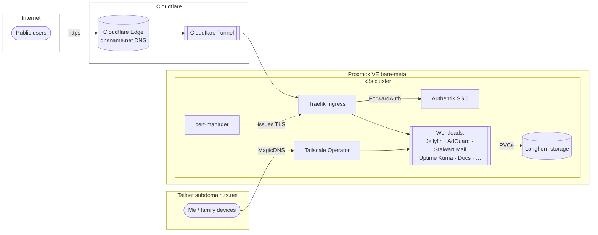
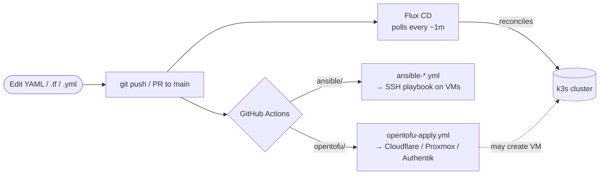

# Hexabyte's Homelab

A self-hosted, GitOps-driven homelab built around a small **k3s Kubernetes cluster on Proxmox**, with everything from VM provisioning to DNS records defined as code. This repository is published as a reference for other self-hosters and as a public, auditable record of how the lab is operated.

**DISCLAIMER** - This is a personal homelab, not a product or template. The architecture, conventions, and configuration choices are specific to my needs and preferences. If you're looking for a copy-paste solution, this isn't it — but if you want to learn how to wire up these technologies in a real-world context, this repo is meant to be readable evidence that it can be done.

**AI DISCLAIMER** - This repo was bootstrapped with the help of generative AI, but every line of code and prose has been reviewed and edited by me. If you see something that looks like it was written by a bot, it probably was — but I take responsibility for all of it.

---

## What is this?

A single, opinionated, end-to-end implementation of the patterns some tutorials teach piecemeal:

- **One repo → entire stack.** Cloud DNS, virtual machines, the cluster, every workload, and the CI/CD that drives them all live here.
- **GitOps reconciliation.** Push to `main`; Flux CD applies the cluster changes, GitHub Actions applies the cloud/VM changes. No `kubectl apply` involved in normal operations.
- **Zero secrets in git.** Every credential is a `REPLACE_ME` placeholder backed by Bitwarden Secrets Manager and patched into the cluster (or into Terraform variables) at deploy time.
- **Two-tier networking.** Private services live on Tailscale (`*.domain.ts.net`); public services come out of a Cloudflare Tunnel (`*.domain.net`) — no ports forwarded.
- **Auth everywhere it matters.** Public services chain through Authentik via Traefik ForwardAuth.

If you're trying to learn how to wire up Flux + Tailscale + Cloudflare Tunnel + Authentik + cert-manager into something that actually works together, this repo is meant to be readable evidence that it can be done.

---

## High-level architecture



`opentofu/` provisions Cloudflare DNS, the tunnel, the Proxmox VMs, Tailscale ACLs and Authentik config. `ansible/` provisions the VMs themselves (k3s, Longhorn prereqs, etc.). Once that's up, `k3s/flux/` and `k3s/manifests/` describe everything _inside_ the cluster.

---

## Tech stack

| Layer             | Technology                   | Why this one                                                           |
| ----------------- | ---------------------------- | ---------------------------------------------------------------------- |
| Virtualization    | Proxmox VE                   | Mature open-source hypervisor; clusterable; easy templating            |
| Kubernetes        | k3s (1 server + 2 agents)    | Lightweight, single-binary, ships sane defaults (Traefik, ServiceLB)   |
| GitOps            | Flux CD                      | Pure-Kubernetes-native, no UI process to operate, Kustomize/Helm-first |
| Ingress (private) | Tailscale Operator           | Tailnet-only services with automatic TLS via tsnet                     |
| Ingress (public)  | Traefik + Cloudflare Tunnel  | No port-forward on the home router; Cloudflare handles DDoS/edge TLS   |
| TLS               | cert-manager + Let's Encrypt | Automatic certificate issuance & rotation                              |
| Storage           | Longhorn                     | Replicated PVs, snapshots, S3 backup                                   |
| Auth / SSO        | Authentik                    | Self-hosted IdP with OIDC, LDAP, and Traefik ForwardAuth               |
| Databases         | CloudNativePG (CNPG)         | Operator-managed Postgres clusters per app                             |
| IaC               | OpenTofu                     | Cloudflare, Proxmox, Tailscale ACLs, Authentik, AWS S3                 |
| Secrets           | Bitwarden Secrets Manager    | Per-service-account access tokens, injected by `bitwarden/sm-action`   |
| CI/CD             | GitHub Actions               | Plan/apply for OpenTofu, Ansible playbook runners, secret patchers     |

---

## Repository layout

```
.
├── k3s/
│   ├── flux/
│   │   ├── clusters/k3s/        # Flux bootstrap — GitRepository + root Kustomizations
│   │   └── apps/                # One Kustomization (or HelmRelease) per service
│   └── manifests/               # Plain Kubernetes manifests, one directory per service
├── opentofu/                    # IaC: Cloudflare, Proxmox VMs, Tailscale, Authentik, S3
├── ansible/                     # VM-level provisioning (not in-cluster services)
│   ├── playbooks/
│   └── templates/
├── docs/                        # MkDocs documentation source (rendered to docs.domain.net)
├── mkdocs.yml
└── .github/workflows/           # opentofu-{plan,apply}, ansible-*, k3s-patch-secrets, …
```

---

## How a change reaches production



For a routine app change (image bump, ingress edit, new manifest), pushing to `main` is enough — Flux notices within a minute and applies it. OpenTofu and Ansible only run for the things they own.

---

## Security & sensitive data

This is a personal homelab repo, made public as a reference. Before browsing:

- **No real secrets are committed.** All credentials, tokens, public IPs, and other sensitive info is injected into GitHub Actions at deploy time.

- **Kubernetes Secret manifests contain `REPLACE_ME` placeholders.** The [`k3s-patch-secrets`](.github/workflows/k3s-patch-secrets.yml) workflow patches the live values into the cluster after deploy, and the `kustomize.toolkit.fluxcd.io/reconcile: disabled` annotation prevents Flux from overwriting them.

If something here looks like a leaked secret, please [open an issue](https://github.com/hexabyte8/homelab/issues).

---

## License & disclaimer

Provided as-is, without warranty. Configuration values, hostnames, and conventions are specific to this lab — copy with adaptation, not as-is. PRs that improve clarity for other readers are welcome.

If you really want a license, it's MIT.
