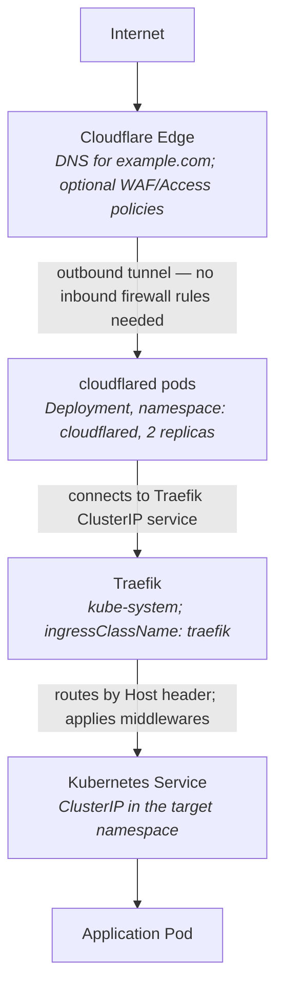
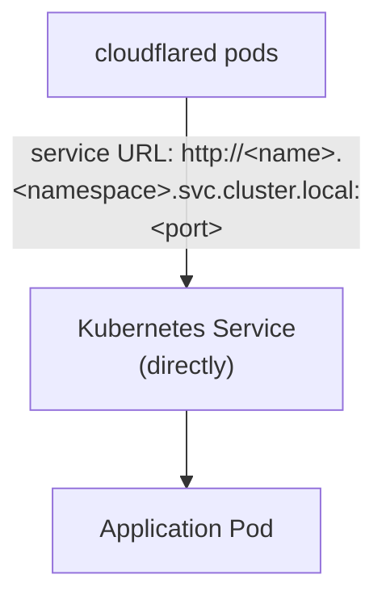

# Cloudflare Tunnels

This document covers deploying and configuring Cloudflare Tunnels (`cloudflared`) in the homelab k3s cluster — what they provide, how to bootstrap the token secret, routing traffic through Traefik, and integrating with Authentik for authentication.

---

## Overview

[Cloudflare Tunnel](https://developers.cloudflare.com/cloudflare-one/connections/connect-networks/) creates an outbound-only encrypted connection from the cluster to Cloudflare's edge network. This means:

- **No inbound firewall ports** — `cloudflared` dials out; nothing reaches the cluster without going through Cloudflare first.
- **Public internet access** — expose services under your own domain (e.g. `myapp.example.com`) without a static IP or port-forwarding.
- **Zero-trust enforcement** — Cloudflare Access policies can require authentication before traffic even reaches the cluster.
- **DDoS/WAF protection** — Cloudflare's edge absorbs attacks before they reach your infrastructure.

### Cloudflare Tunnel vs. Tailscale Funnel

Both solutions expose homelab services to the public internet without inbound ports, but they serve different purposes:

| Feature | Cloudflare Tunnel | Tailscale Funnel |
|---|---|---|
| **Custom domain** | Yes (`myapp.example.com`) | No (`.ts.net` only) |
| **DDoS / WAF** | Yes (Cloudflare edge) | No |
| **Cloudflare Access policies** | Yes | No |
| **TLS** | Cloudflare-terminated (or pass-through) | Tailscale-terminated |
| **DNS requirement** | Domain on Cloudflare | None |
| **Use case** | Public-facing services | Quick personal/team access |

The current cluster uses **Tailscale Funnel** for the Authentik UI and similar services. Cloudflare Tunnel is the preferred option when you need a proper public domain, WAF protection, or Cloudflare Access.

---

## Architecture



**Alternative — direct service routing (bypassing Traefik):**



Direct routing is useful for services that do not need Traefik middleware (e.g. raw TCP, gRPC). Routing via Traefik is **recommended** for HTTP services because it gives you consistent middleware (ForwardAuth, TLS redirects, rate limiting) without duplicating configuration in the Cloudflare dashboard.

---

## Prerequisites

1. **Cloudflare account** with the `example.com` domain managed by Cloudflare DNS.
2. **A tunnel created** in the Cloudflare dashboard:
   - Go to **Zero Trust → Networks → Tunnels → Create a tunnel**.
   - Choose **Cloudflared** connector type, give it a name (e.g. `homelab`).
   - Copy the **tunnel token** shown on the configuration page — you will need it in the next step.
3. **kubectl access** to the cluster.

---

## Initial Setup: Applying the Tunnel Token

The `cloudflared-tunnel-credentials` Secret committed to git (`k3s/manifests/cloudflared/secret.yaml`) contains a placeholder value:

```yaml
stringData:
  tunnel-token: "REPLACE_ME"
```

**Never replace this placeholder in git.** Instead, apply the real token directly to the cluster using `kubectl patch` — this avoids field manager conflicts with Flux's Server-Side Apply:

```bash
# Base64-encode your token, then patch the secret
kubectl patch secret cloudflared-tunnel-credentials \
  -n cloudflared \
  --type='merge' \
  -p '{"data":{"tunnel-token":"'$(echo -n '<YOUR_TOKEN_FROM_CLOUDFLARE_DASHBOARD>' | base64 -w0)'"}}'
```

> **Why `kubectl patch` instead of `kubectl apply`?** Flux uses Server-Side Apply (SSA) and tracks field ownership. Using `kubectl apply` can cause field manager conflicts. `kubectl patch --type=merge` updates only the specified fields without taking ownership of the whole object. The secret also carries `kustomize.toolkit.fluxcd.io/reconcile: disabled`, which prevents Flux from ever overwriting your real token with the `REPLACE_ME` placeholder.

> **Important:** The `cloudflared` deployment will crash-loop (`CrashLoopBackOff`) until a valid token is present in the secret. Apply the token **before** or immediately after the first Flux reconcile.

To find your token again at any time: **Zero Trust → Networks → Tunnels → your tunnel → Configure → Overview tab**.

---

## Deploying cloudflared via Flux

### Flux Kustomization

`cloudflared` is deployed and managed by Flux via `k3s/flux/apps/cloudflared.yaml`. The secret `cloudflared-tunnel-credentials` carries the annotation `kustomize.toolkit.fluxcd.io/reconcile: disabled`, which prevents Flux from overwriting the real tunnel token with the `REPLACE_ME` placeholder on every reconcile.

### Verifying the deployment

```bash
# Check pods are running (should see 2 replicas)
kubectl get pods -n cloudflared

# Check logs for successful tunnel connection
kubectl logs -n cloudflared -l app=cloudflared --tail=50

# Expected log lines indicating a healthy tunnel:
# INF Connection <uuid> registered connIndex=0 ...
# INF Connection <uuid> registered connIndex=1 ...
```

Confirm in the Cloudflare dashboard: **Zero Trust → Networks → Tunnels** — the tunnel status should show **Healthy** once at least one `cloudflared` pod connects.

---

## Configuring Routes via OpenTofu

All routing and DNS is managed via OpenTofu in `opentofu/cloudflare-tunnel.tf` — **not** the Cloudflare Zero Trust dashboard. Changes are applied automatically when commits are pushed to `main` (the OpenTofu Apply GitHub Actions workflow triggers on push).

The `cloudflare_zero_trust_tunnel_cloudflared_config` resource holds all ingress rules. Each service entry maps a hostname to an upstream service URL. The catch-all `http_status:404` entry must always be last:

```hcl
resource "cloudflare_zero_trust_tunnel_cloudflared_config" "homelab" {
  account_id = var.cloudflare_account_id
  tunnel_id  = cloudflare_zero_trust_tunnel_cloudflared.homelab.id
  config = {
    ingress = [
      {
        hostname = "myapp.${var.cloudflare_zone_name}"
        service  = "http://traefik.kube-system.svc.cluster.local:80"
      },
      # ... other services ...
      {
        service = "http_status:404"  # catch-all — must be last
      }
    ]
  }
}
```

Using Traefik's cluster-internal DNS name (`traefik.kube-system.svc.cluster.local`) as the upstream means Cloudflare Tunnel forwards all traffic to Traefik, which then routes by the `Host` header — exactly as if the request had arrived from the internet normally.

**Direct-to-service alternative** (bypassing Traefik):

```hcl
service = "http://<service-name>.<namespace>.svc.cluster.local:<port>"
```

Use direct routing only when Traefik middleware is not needed.

---

## Adding a New Service

Adding a service via Cloudflare Tunnel requires three changes: two in `opentofu/cloudflare-tunnel.tf` (tunnel routing + DNS record) and one Kubernetes Ingress manifest.

### Step 1 — Add the ingress entry and DNS record in OpenTofu

Edit `opentofu/cloudflare-tunnel.tf`. Add a new entry to the `ingress` list inside `cloudflare_zero_trust_tunnel_cloudflared_config.homelab` (before the catch-all `http_status:404` entry), and add a `cloudflare_dns_record` resource:

```hcl
# In the existing cloudflare_zero_trust_tunnel_cloudflared_config.homelab resource,
# add to the ingress list (before the catch-all):
{
  hostname = "myapp.${var.cloudflare_zone_name}"
  service  = "http://traefik.kube-system.svc.cluster.local:80"
},

# New standalone resource in the same file:
resource "cloudflare_dns_record" "myapp" {
  zone_id = var.cloudflare_zone_id
  name    = "myapp"
  content = "${cloudflare_zero_trust_tunnel_cloudflared.homelab.id}.cfargotunnel.com"
  type    = "CNAME"
  ttl     = 1
  proxied = true
}
```

The `content` references the tunnel ID directly via the resource reference — no need to hard-code a UUID.

### Step 2 — Traefik Ingress manifest

Create `k3s/manifests/myapp/ingress-cloudflare.yaml` with `ingressClassName: traefik`. Include the Authentik middleware annotation if the service should be protected by SSO:

```yaml
apiVersion: networking.k8s.io/v1
kind: Ingress
metadata:
  name: myapp
  namespace: myapp
  annotations:
    cert-manager.io/cluster-issuer: letsencrypt-production
    traefik.ingress.kubernetes.io/router.middlewares: authentik-authentik-forward-auth@kubernetescrd
spec:
  ingressClassName: traefik
  rules:
    - host: myapp.example.com
      http:
        paths:
          - path: /
            pathType: Prefix
            backend:
              service:
                name: myapp
                port:
                  number: 80
  tls:
    - hosts:
        - myapp.example.com
      secretName: myapp-tls
```

> **TLS note:** cert-manager will provision a Let's Encrypt certificate for `myapp.example.com`. The proxied CNAME DNS record created by OpenTofu satisfies the HTTP-01 challenge via Cloudflare.

Remove the `traefik.ingress.kubernetes.io/router.middlewares` annotation if Authentik protection is not needed.

### Step 3 — Commit and push

```bash
git add opentofu/cloudflare-tunnel.tf k3s/manifests/myapp/ingress-cloudflare.yaml
git commit -m "feat: expose myapp via Cloudflare Tunnel"
git push origin main
```

Pushing to `main` triggers the **OpenTofu Apply** GitHub Actions workflow, which applies the DNS record and tunnel routing automatically. Flux reconciles the Kubernetes Ingress within ~10 minutes.

---

## Authentik Integration

There are two ways to add authentication to a Cloudflare-tunnelled service. Choose based on where you want the auth boundary to sit.

---

### Approach A: Traefik ForwardAuth (Recommended for internal auth)

**Traffic flow:**
```
User → Cloudflare Edge → cloudflared → Traefik → authentik-forward-auth middleware → Service
```

Authentication is enforced by Traefik using the `authentik-forward-auth` middleware (already deployed in the `authentik` namespace). Unauthenticated requests are redirected to Authentik's login page. Once authenticated, the request continues to the upstream service.

#### Ingress manifest with ForwardAuth

```yaml
apiVersion: networking.k8s.io/v1
kind: Ingress
metadata:
  name: myapp
  namespace: myapp
  annotations:
    traefik.ingress.kubernetes.io/router.middlewares: >-
      kube-system-cloudflare-https-scheme@kubernetescrd,authentik-authentik-forward-auth@kubernetescrd
    cert-manager.io/cluster-issuer: letsencrypt-production
spec:
  ingressClassName: traefik
  rules:
    - host: myapp.example.com
      http:
        paths:
          - path: /
            pathType: Prefix
            backend:
              service:
                name: myapp
                port:
                  number: 80
  tls:
    - hosts:
        - myapp.example.com
      secretName: myapp-tls
```

Two middlewares are chained — **order matters**:

1. `kube-system-cloudflare-https-scheme@kubernetescrd` — rewrites `X-Forwarded-Proto` to `https` before ForwardAuth sees the request. This is required because `cloudflared` connects to Traefik over `http://`, causing Traefik to set `X-Forwarded-Proto: http`. Without this fix, Authentik builds the OIDC callback URL with an `http://` redirect URI, which it then rejects as invalid.

2. `authentik-authentik-forward-auth@kubernetescrd` — the ForwardAuth middleware itself.

The `cloudflare-https-scheme` Middleware is defined in `k3s/manifests/traefik/cloudflare-https-middleware.yaml` (namespace `kube-system`). It is a cluster-wide resource and does not need to be recreated per service.

#### Configuring the application in Authentik

ForwardAuth requires an Authentik **Proxy Provider** and an **Application** entry. The embedded outpost handles the actual auth check automatically.

1. Log in to Authentik at `https://authentik.tailnet.ts.net` as `akadmin`.

2. Go to **Applications → Providers → Create**.

3. Select **Proxy Provider** and fill in:
   - **Name**: `myapp-proxy`
   - **Authorization flow**: `default-provider-authorization-implicit-consent`
   - **Mode**: `Forward auth (single application)`
   - **External Host**: `https://myapp.example.com`

4. Click **Finish**.

5. Go to **Applications → Applications → Create** and fill in:
   - **Name**: `myapp`
   - **Slug**: `myapp`
   - **Provider**: select `myapp-proxy`
   - **Launch URL**: `https://myapp.example.com`

6. Under **Policy / Group / User bindings**, add any group restrictions if required (leave empty to allow all authenticated users).

7. Go to **Applications → Outposts** and find the **embedded outpost** (type: `Proxy`).

8. Edit the embedded outpost and add `myapp` to the **Applications** list. Save.

9. Verify the ForwardAuth URL in the outpost configuration matches:
   ```
   http://authentik-server.authentik.svc.cluster.local/outpost.goauthentik.io/auth/traefik
   ```
   This is the URL the `authentik-forward-auth` Traefik middleware calls.

> **Note:** Authentik auto-registers new applications with the embedded outpost on save in recent versions. If auth is not working after step 5, check step 7–8 manually.

---

### Approach B: Cloudflare Access with Authentik as OIDC Provider (Recommended for public services)

**Traffic flow:**
```
User → Cloudflare Edge → Cloudflare Access (OIDC login via Authentik) → cloudflared → Traefik → Service
```

With Cloudflare Access, authentication happens at the Cloudflare edge — unauthenticated traffic never reaches the cluster at all. Authentik acts as the OIDC identity provider.

This approach is preferable for:
- Services exposed to the public internet where you want Cloudflare as the first line of defence.
- Cases where you cannot or do not want ForwardAuth middleware on every Ingress.

#### Step 1 — Configure Authentik as an OIDC provider

1. Log in to Authentik at `https://authentik.tailnet.ts.net`.

2. Go to **Applications → Providers → Create**.

3. Select **OAuth2/OpenID Connect Provider** and fill in:
   - **Name**: `Cloudflare Access`
   - **Client type**: `Confidential`
   - **Client ID**: `cloudflare-access` (or leave auto-generated and note it down)
   - **Client Secret**: note down the generated value
   - **Redirect URIs**: `https://<your-team-name>.cloudflareaccess.com/cdn-cgi/access/callback`
     (replace `<your-team-name>` with your Cloudflare Zero Trust team name — visible in Zero Trust → Settings → General)
   - **Signing Key**: select your default certificate
   - **Scopes**: ensure `openid`, `profile`, and `email` are included

4. Click **Finish**.

5. Go to **Applications → Applications → Create** and link this provider:
   - **Name**: `Cloudflare Access`
   - **Slug**: `cloudflare-access`
   - **Provider**: `Cloudflare Access`

#### Step 2 — Add Authentik as a login method in Cloudflare Zero Trust

1. Go to **Zero Trust → Settings → Authentication**.

2. Under **Login methods**, click **Add new → OpenID Connect**.

3. Fill in:
   | Field | Value |
   |---|---|
   | **Name** | `Authentik` |
   | **Client ID** | the client ID from Authentik |
   | **Client Secret** | the client secret from Authentik |
   | **Auth URL** | `https://authentik.tailnet.ts.net/application/o/cloudflare-access/` |
   | **Token URL** | `https://authentik.tailnet.ts.net/application/o/token/` |
   | **Certificate URL** | `https://authentik.tailnet.ts.net/application/o/cloudflare-access/jwks/` |

4. Click **Save** and test the connection.

> **Note:** The URLs above use the Tailscale Funnel address (`tailnet.ts.net`). If Authentik has been moved to a Cloudflare Tunnel URL (`authentik.example.com`), substitute that domain instead.

#### Step 3 — Create a Cloudflare Access policy for the service

1. Go to **Zero Trust → Access → Applications → Add an application**.

2. Select **Self-hosted** and fill in:
   - **Application name**: `myapp`
   - **Application domain**: `myapp.example.com`

3. Under **Policies**, create a policy:
   - **Policy name**: `Authentik users`
   - **Action**: `Allow`
   - **Include rule**: `Login Methods → Authentik` (or restrict further by email/group)

4. Under **Authentication**, select **Authentik** as the identity provider.

5. Click **Save**.

With this in place, any user hitting `myapp.example.com` must authenticate with Authentik before Cloudflare forwards the request to `cloudflared`.

---

## Exposing Authentik Itself via Cloudflare Tunnel

Authentik is currently accessible via Tailscale Funnel at `https://authentik.tailnet.ts.net`. To also (or instead) expose it via Cloudflare Tunnel:

### Traefik Ingress for Authentik

`k3s/manifests/authentik/ingress-cloudflare.yaml`:

```yaml
apiVersion: networking.k8s.io/v1
kind: Ingress
metadata:
  name: authentik-cloudflare
  namespace: authentik
  annotations:
    cert-manager.io/cluster-issuer: letsencrypt-production
    # Do NOT add ForwardAuth middleware here — Authentik IS the auth provider
spec:
  ingressClassName: traefik
  rules:
    - host: authentik.example.com
      http:
        paths:
          - path: /
            pathType: Prefix
            backend:
              service:
                name: authentik-server
                port:
                  number: 80
  tls:
    - hosts:
        - authentik.example.com
      secretName: authentik-cloudflare-tls
```

### OpenTofu route (direct to Authentik, bypassing Traefik)

Alternatively, add an ingress entry in `opentofu/cloudflare-tunnel.tf` that points directly at the Authentik server service without going through Traefik:

```hcl
# In cloudflare_zero_trust_tunnel_cloudflared_config.homelab ingress list:
{
  hostname = "authentik.${var.cloudflare_zone_name}"
  service  = "http://authentik-server.authentik.svc.cluster.local:80"
},
```

> **Important:** Do **not** apply a Cloudflare Access policy to `authentik.example.com`. Authentik is the identity provider — gating it behind itself would create an unresolvable authentication loop.

---

## Troubleshooting

### Tunnel not connecting / pods crash-looping

```bash
# Check pod status
kubectl get pods -n cloudflared

# Check logs for auth errors
kubectl logs -n cloudflared -l app=cloudflared --tail=100
```

Common causes:
- `failed to authenticate tunnel`: the `tunnel-token` secret value is wrong or still `REPLACE_ME`. Re-apply the correct token (see [Initial Setup](#initial-setup-applying-the-tunnel-token)).
- `context canceled` / repeated reconnect attempts: transient network issue or Cloudflare edge problem. Usually self-resolves; check tunnel status at [dash.cloudflare.com](https://dash.cloudflare.com) → Zero Trust → Networks → Tunnels.

### Tunnel not connecting — QUIC / UDP blocked

Symptoms: cloudflared logs show repeated messages like `failed to dial to edge with quic: timeout` but the pods are running.

`cloudflared` defaults to QUIC (UDP 7844) for the outbound tunnel connection. Many home routers or ISPs block outbound UDP on non-standard ports. Fix by forcing HTTP/2 (TCP 443) in the configmap:

```yaml
# k3s/manifests/cloudflared/configmap.yaml
data:
  config.yaml: |
    protocol: http2
    metrics: 0.0.0.0:2000
    no-autoupdate: true
```

The `protocol: http2` setting is already applied in this cluster's configmap. If you ever redeploy from scratch, ensure this key is present.

### 502 Bad Gateway / 503 Service Unavailable

The service URL in `opentofu/cloudflare-tunnel.tf` (the `service` field of the ingress entry) is wrong or the upstream is not ready.

```bash
# Verify Traefik is running and the service URL resolves
kubectl get svc -n kube-system traefik

# Check Traefik logs for routing errors
kubectl logs -n kube-system -l app.kubernetes.io/name=traefik --tail=100

# Check the Ingress has an address assigned
kubectl get ingress -n myapp
```

Confirm the service URL in `opentofu/cloudflare-tunnel.tf` exactly matches `http://traefik.kube-system.svc.cluster.local:80` (note the port — Traefik's ClusterIP listens on 80 for HTTP).

### Authentik redirect loop or 400 on callback

Symptoms: browser loops between `myapp.example.com` and the Authentik login page without ever authenticating, or you see a `400 Bad Request` on `/outpost.goauthentik.io/callback` after a successful login.

Causes:

- **Missing `cloudflare-https-scheme` middleware**: `cloudflared` connects to Traefik over `http://`, so Traefik sets `X-Forwarded-Proto: http`. Authentik then builds the OIDC callback URL with `http://`, which it rejects. **Always chain `kube-system-cloudflare-https-scheme@kubernetescrd` before the ForwardAuth middleware** (see ingress example above).
- **External Host mismatch**: the Proxy Provider's **External Host** in Authentik is `http://...` but the site is accessed over `https://...`, or the domain is wrong. Correct it in **Applications → Providers → your provider → External Host**. Must be the exact `https://` URL users visit.
- **Cookie domain mismatch**: if Authentik and the app are on different domains (e.g. `tailnet.ts.net` vs `example.com`), the ForwardAuth session cookie cannot be shared. Move Authentik to a `example.com` subdomain (see [Exposing Authentik Itself](#exposing-authentik-itself-via-cloudflare-tunnel)).
- **Outpost not updated**: after creating the Proxy Provider and Application, the embedded outpost must have the application assigned (Step 7–8 in [Approach A](#approach-a-traefik-forwardauth-recommended-for-internal-auth)).

### CORS errors

If a service returns CORS errors when accessed via `myapp.example.com`:

- Ensure the application's allowed origins include `https://myapp.example.com`.
- In the Cloudflare dashboard, check the tunnel's public hostname **Additional application settings → HTTP Settings** for any headers that might conflict.

### Cloudflare Access loop (Approach B)

If Cloudflare Access redirects infinitely:
- Verify the OIDC callback URL in the Authentik provider matches exactly: `https://<team-name>.cloudflareaccess.com/cdn-cgi/access/callback`.
- Confirm `authentik.tailnet.ts.net` (or `authentik.example.com`) is reachable from your browser — Cloudflare Access will redirect there for login.
- Check Authentik's system logs under **System → System Tasks** for OIDC-related errors.

---

## Reference

| Resource | Value |
|---|---|
| Cloudflare Zero Trust | <https://one.dash.cloudflare.com> |
| Tunnel config path | Zero Trust → Networks → Tunnels |
| cloudflared namespace | `cloudflared` |
| Tunnel token secret | `cloudflared-tunnel-credentials` (key: `tunnel-token`) |
| cloudflared image | `cloudflare/cloudflared:2025.1.0` |
| Traefik ClusterIP | `traefik.kube-system.svc.cluster.local:80` |
| Authentik server ClusterIP | `authentik-server.authentik.svc.cluster.local:80` |
| ForwardAuth middleware ref | `authentik-authentik-forward-auth@kubernetescrd` |
| ForwardAuth URL | `http://authentik-server.authentik.svc.cluster.local/outpost.goauthentik.io/auth/traefik` |

**See also:**

- [authentik.md](authentik.md) — full Authentik deployment and ForwardAuth reference
- [gitops-flux.md](gitops-flux.md) — secrets patching pattern, Flux Kustomization structure
- [tailscale-operator.md](tailscale-operator.md) — Tailscale Funnel (alternative public exposure)
- [new-service.md](new-service.md) — end-to-end guide for adding a new service
