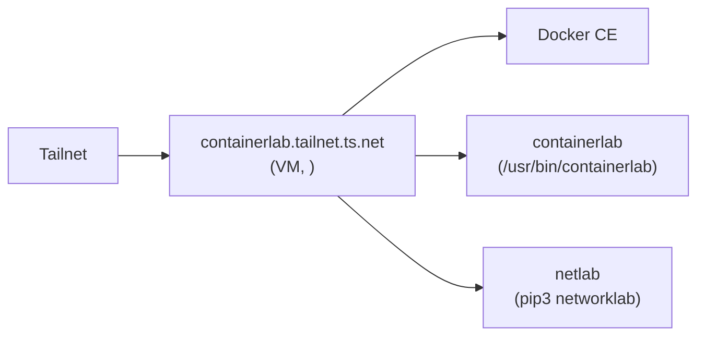

# ContainerLab

[ContainerLab](https://containerlab.dev) is a CLI tool for orchestrating container-based network topologies. It runs each lab node (Nokia SR Linux, Arista cEOS, FRR, Cisco IOL, SONiC, etc.) as a Docker container, wires them together with Linux veth pairs, and exposes their management interfaces on the host. This homelab runs ContainerLab on a dedicated Proxmox VM alongside [netlab](https://netlab.tools) for higher-level topology generation.

## Architecture



| Fact             | Value                                              |
| ---------------- | -------------------------------------------------- |
| VM name          | `containerlab`                                     |
| Proxmox VMID     | `105`                                              |
| LAN IP           | `192.168.x.x/24`                                 |
| Tailnet name     | `containerlab.tailnet.ts.net`                      |
| Resources        | 4 vCPU (`cpu type = host`), 16 GB RAM, 100 GB disk |
| OS user          | `ubuntu` (in `docker` group)                       |
| Labs working dir | `/home/ubuntu/labs`                                |
| Tailscale tag    | `tag:server` (Tailscale SSH enabled)               |

The VM uses `cpu { type = "host" }` so that virtualisation extensions (VT-x / AMD-V) are exposed to the guest. This is required for VM-based NOS images such as Cisco IOSv / IOS XRv / CSR1000v and Arista vEOS that run inside ContainerLab via QEMU-backed kinds (`vrnetlab`).

## Access

The VM is on the tailnet automatically — cloud-init installs Tailscale and runs `tailscale up --advertise-tags=tag:server --ssh` on first boot, so no additional setup is needed to reach it.

### From any tailnet device

```bash
# Preferred — Tailscale SSH, no key management needed
tailscale ssh ubuntu@containerlab

# Or using MagicDNS + standard OpenSSH
ssh ubuntu@containerlab.tailnet.ts.net
```

`tailscale ssh` is granted by the tailnet ACL (`src: autogroup:owner → dst: tag:server`), so it works from any of your tailnet nodes without per-host SSH keys.

## Initial deployment

The VM is provisioned automatically by OpenTofu (`opentofu/containerlab.tf`) when changes are pushed to `main`. After the VM is up and on the tailnet, run the Ansible workflow once to install Docker, ContainerLab, and netlab:

1. Go to **Actions → [Ansible - Deploy ContainerLab](https://github.com/hexabyte8/homelab/actions/workflows/ansible-containerlab.yml)**.
2. Click **Run workflow**.
3. Leave `target_host` as `containerlab` (the default).
4. Confirm — the workflow authenticates via Bitwarden → Tailscale OAuth → SSH → `ansible/playbooks/deploy_containerlab.yml`.

The workflow is idempotent — re-running it will pick up Docker / ContainerLab upgrades without rebuilding state.

### What the playbook installs

| Component     | Source                                  | Verify                       |
| ------------- | --------------------------------------- | ---------------------------- |
| Docker CE     | `download.docker.com` apt repo          | `docker info`                |
| ContainerLab  | `https://containerlab.dev/setup` script | `containerlab version`       |
| netlab        | `pip3 install networklab`               | `netlab --version`           |
| sysctl tuning | `/etc/sysctl.d/30-containerlab.conf`    | `sysctl net.ipv4.ip_forward` |

### Kernel tuning rationale

`/etc/sysctl.d/30-containerlab.conf` sets four kernel parameters that ContainerLab topologies need:

| Setting                                                                                | Why                                                                                                                             |
| -------------------------------------------------------------------------------------- | ------------------------------------------------------------------------------------------------------------------------------- |
| `net.ipv4.ip_forward = 1` and `net.ipv6.conf.all.forwarding = 1`                       | Required for routing between lab nodes.                                                                                         |
| `net.ipv4.conf.all.rp_filter = 0`                                                      | ContainerLab wires nodes together with asymmetric veth pairs; strict reverse-path filtering drops legitimate lab traffic.       |
| `net.bridge.bridge-nf-call-iptables = 0` and `net.bridge.bridge-nf-call-ip6tables = 0` | ContainerLab manages its own L2 bridging; passing bridged frames through iptables double-NATs and breaks topology connectivity. |

## Running your first lab

SSH into the VM, drop a topology file in `~/labs/`, and deploy it:

```bash
tailscale ssh ubuntu@containerlab
cd ~/labs
cat > srl01.clab.yaml <<'EOF'
name: srl01
topology:
  nodes:
    srl1:
      kind: nokia_srlinux
      image: ghcr.io/nokia/srlinux
    srl2:
      kind: nokia_srlinux
      image: ghcr.io/nokia/srlinux
  links:
    - endpoints: [srl1:e1-1, srl2:e1-1]
EOF

sudo containerlab deploy -t srl01.clab.yaml
sudo containerlab inspect -t srl01.clab.yaml
```

Connect to a node's CLI:

```bash
ssh admin@clab-srl01-srl1      # password: NokiaSrl1!
```

Destroy the lab when done:

```bash
sudo containerlab destroy -t srl01.clab.yaml --cleanup
```

`sudo` is required because ContainerLab creates veth pairs, Linux bridges, and network namespaces. The `ubuntu` user is in the `docker` group so plain `docker` commands do not need `sudo`.

## netlab (network-lab)

[netlab](https://netlab.tools) is installed alongside ContainerLab. It generates ContainerLab topologies from a compact YAML description and can render device configs automatically. NetBox-integrated workflows are possible by pointing `netlab` at the NetBox VM.

```bash
mkdir -p ~/labs/netlab-demo && cd ~/labs/netlab-demo
netlab create       # generates clab.yml, hosts, and device configs
netlab up           # deploys via containerlab + applies configs
netlab down         # tears down
```

## Upgrading

ContainerLab and netlab are both picked up when the Ansible workflow is re-run:

- ContainerLab: the setup script installs the latest `.deb` release each run.
- netlab: `ansible.builtin.pip` with `state: present` does not upgrade in place — pass `state: latest` on a one-off run if you want to force it, or run `pip3 install --upgrade networklab` manually on the VM.

Docker images used by lab topologies are pulled on demand by `containerlab deploy` and cached locally; clean up with `docker image prune` periodically.

## Troubleshooting

### `containerlab deploy` fails with "operation not permitted" on interface creation

The sysctl rules from `/etc/sysctl.d/30-containerlab.conf` did not apply. Check and reapply:

```bash
sudo sysctl --system
sudo sysctl net.ipv4.ip_forward net.ipv6.conf.all.forwarding \
            net.ipv4.conf.all.rp_filter \
            net.bridge.bridge-nf-call-iptables net.bridge.bridge-nf-call-ip6tables
```

Expected values: `net.ipv4.ip_forward=1`, `net.ipv6.conf.all.forwarding=1`, `net.ipv4.conf.all.rp_filter=0`, `net.bridge.bridge-nf-call-iptables=0`, `net.bridge.bridge-nf-call-ip6tables=0`.

### VM-based NOS images (Cisco, Arista vEOS) fail to boot

Confirm KVM is available inside the VM:

```bash
ls /dev/kvm && egrep -c '(vmx|svm)' /proc/cpuinfo
```

Both should succeed with non-zero output. If not, the Proxmox VM is not using `cpu type = host` — check `opentofu/containerlab.tf`.

### Reaching a lab node from another tailnet device

ContainerLab exposes node management ports on the VM's primary interface. Once you know the mapped port (`containerlab inspect -t <topology>.clab.yaml`), connect using the VM's tailnet name, e.g.:

```bash
ssh admin@containerlab.tailnet.ts.net -p 50001
```

No Tailscale Ingress or operator changes are required — the VM itself is the tailnet endpoint.
