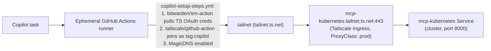

# GitHub Copilot Cloud Agent

This page documents how the Copilot cloud agent (the background agent that
opens PRs from Copilot tasks) is wired into this homelab so it can reach
in-cluster MCP servers over the private tailnet.

The pattern is intentionally the same as our other GitHub Actions workflows:
pull a Tailscale OAuth client from Bitwarden Secrets Manager and join the
runner to the tailnet with a dedicated tag.

---

## Architecture



The runner is only allowed to reach the mcp-kubernetes proxy pod on
`tcp:443`. It has no other grants of its own — see `opentofu/tailscale.tf`.

---

## In-repo pieces

| File | Purpose |
|---|---|
| `.github/workflows/copilot-setup-steps.yml` | Runs before every Copilot session. Joins the runner to the tailnet as `tag:copilot`, enables MagicDNS, and probes the MCP endpoint as a diagnostic. |
| `opentofu/tailscale.tf` | Declares `tag:copilot` as a tagOwner and grants `tag:copilot → tag:k8s-operator:443`. |

### Bitwarden items reused

The workflow reuses the same Bitwarden items as `ansible-k3s.yml`:

| Bitwarden item ID | Env var |
|---|---|
| `<bws-uuid-tailscale-oauth-client-id>` | `TAILSCALE_OAUTH_CLIENT_ID` |
| `<bws-uuid-tailscale-oauth-client-secret>` | `TAILSCALE_OAUTH_CLIENT_SECRET` |

---

## Out-of-band (one-time) setup

These steps cannot be expressed in code and must be done manually:

1. **Tailscale admin UI** — open the OAuth client in use (the same one used by
   `ansible-k3s.yml` etc.) and add `tag:copilot` to its allowed tags. Without
   this, `tailscale/github-action@v2` will fail with a `tag not permitted`
   error.

2. **GitHub `copilot` Actions environment** — Copilot-triggered runs of
   `copilot-setup-steps.yml` only see secrets from the repository's `copilot`
   environment. Create the environment (Settings → Environments → New
   environment → `copilot`) and add:

   - `BW_ACCESS_TOKEN` — same Bitwarden machine account access token used by
     the other workflows.

   Regular (`workflow_dispatch` / PR) runs of the same workflow continue to
   use repository-level secrets, so keep `BW_ACCESS_TOKEN` configured there
   too.

3. **Copilot MCP configuration** — in the repository settings
   (Settings → Copilot → Coding agent → MCP configuration) paste:

   ```json
   {
     "mcpServers": {
       "kubernetes": {
         "type": "http",
         "url": "https://mcp-kubernetes.tailnet.ts.net/mcp",
         "tools": ["*"]
       }
     }
   }
   ```

   No auth header is required — being on the tailnet is the credential.

4. **Copilot firewall (only if the first run fails)** — the Copilot cloud
   agent ships with an egress firewall. If the `Setup Tailscale` step fails
   with a network error, relax the firewall (Settings → Copilot → Coding
   agent → Firewall) to allow:

   - `login.tailscale.com`
   - `controlplane.tailscale.com`
   - `*.tailscale.com` (DERP relays)

---

## Validating

After merging to `main`:

1. Run `Copilot Setup Steps` manually from the **Actions** tab. The
   diagnostic step should log a resolved IP and an HTTP status code for
   `mcp-kubernetes.tailnet.ts.net`.
2. Start a Copilot task that needs cluster access (e.g. "list all pods in
   `jellyfin` namespace"). The setup steps logs appear in the session
   transcript.
3. After the session, the Tailscale admin UI should show the `tag:copilot`
   node as expired/offline (the action logs out at end of job).

---

## Hardening notes

- `tag:copilot` is deliberately narrower than `tag:ci`. It cannot SSH to
  `autogroup:tagged`, cannot reach `tag:server`, and is not a Funnel node.
- The existing ACL still contains a broad `{src: ["*"], dst: ["*"]}` grant.
  Tightening that is out of scope for this change but would make the
  `tag:copilot → tag:k8s-operator:443` grant the only path available.
- Consider provisioning a dedicated Tailscale OAuth client scoped solely to
  `tag:copilot` (and storing new Bitwarden item IDs) if you want to remove
  the shared blast radius with `ansible-k3s.yml` et al.
