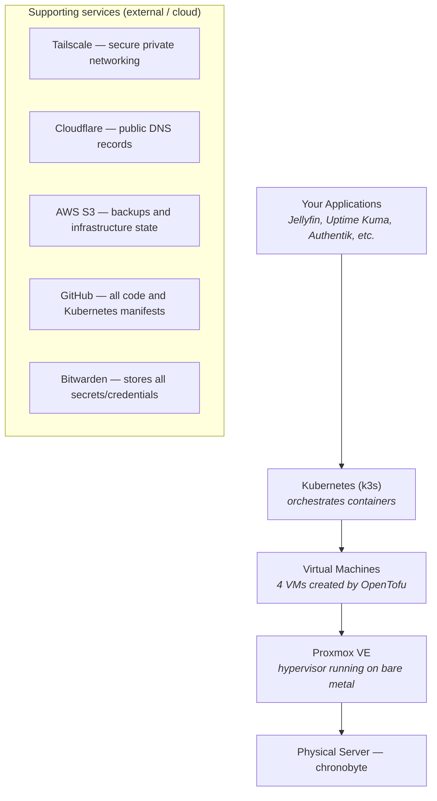
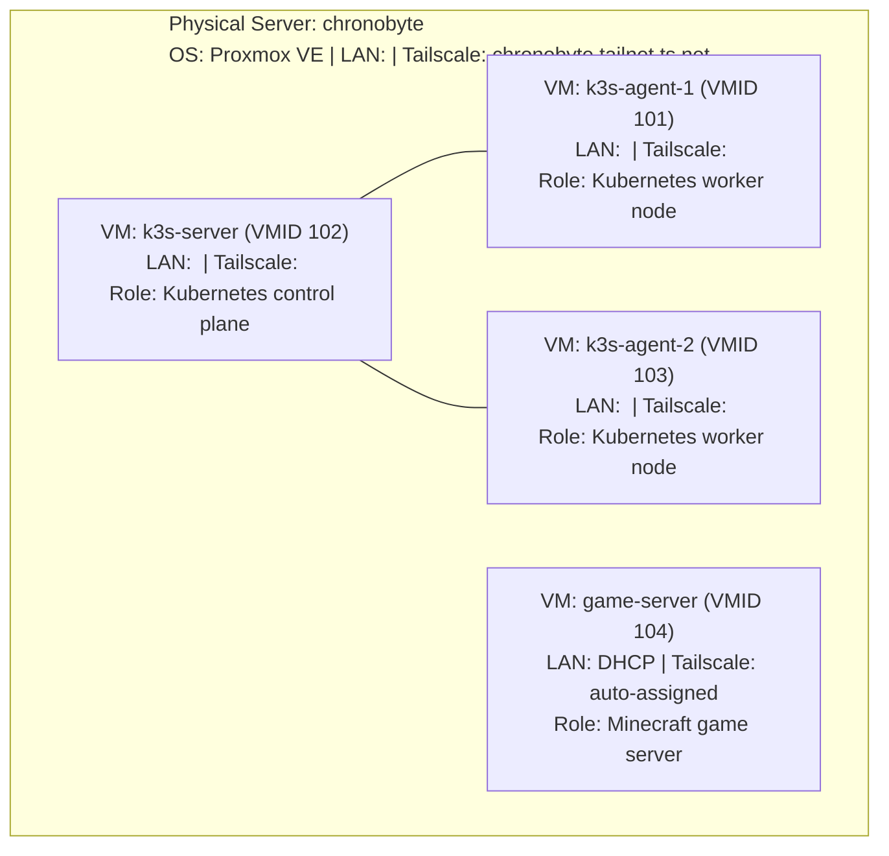

# Disaster Recovery — Overview

> **Scope:** Complete homelab rebuild from zero. Use this guide when the physical Proxmox server
> (`chronobyte`) is destroyed, unbootable, or otherwise unrecoverable.
>
> A reader with access to the Bitwarden vault and minimal technical knowledge can follow
> this guide end-to-end and restore the entire homelab stack.

---

## What is this Homelab?

This homelab runs a small Kubernetes cluster on a single physical server using several
layers of technology stacked on top of each other. Here is what each layer does:

**The key insight:** everything except the physical hardware is either stored in the cloud
(code in GitHub, state in AWS S3, backups in S3, secrets in Bitwarden) or can
be recreated automatically. This is why recovery is possible from zero.

---

## Recovery Phases

Follow these phases in order. Each phase links to a dedicated document with full details.

| # | Phase | Time | Description |
|---|-------|------|-------------|
| 0 | [Prerequisites](./00-prerequisites.md) | 15 min | Verify Bitwarden vault and gather all credentials |
| 1 | [External Services](./01-external-services.md) | 10 min | Confirm GitHub, AWS S3, Cloudflare, Tailscale are intact |
| 2 | [Proxmox Rebuild](./02-proxmox-rebuild.md) | 30–45 min | Install Proxmox VE, configure network, create VM template |
| 3 | [OpenTofu Apply](./03-opentofu-apply.md) | 15 min | Provision all 4 VMs, DNS records, S3 bucket, Tailscale keys |
| 4 | [k3s Cluster](./04-k3s-cluster.md) | 20 min | Deploy Kubernetes control plane and worker nodes |
| 5 | [Flux Bootstrap](./05-flux-bootstrap.md) | 15 min | Install Flux CD and trigger GitOps reconcile |
| 6 | [Secrets Restore](./06-secrets-restore.md) | 10 min | Apply secrets that cannot be stored in git |
| 7 | [Validation](./07-validation.md) | 15 min | Verify all services are healthy |

**Total estimated time: 2–3 hours** (assuming Proxmox installs cleanly and VMs boot without issues)

---

## What is NOT Lost in a Hardware Failure

Because critical state lives outside the physical server:

| Data | Location | Notes |
|------|----------|-------|
| All Kubernetes manifests | GitHub (`hexabyte8/homelab`) | Everything needed to redeploy every service |
| OpenTofu infrastructure state | AWS S3 (`chronobyte-homelab-tf-state`) | Tracks all created VMs, DNS records, S3 buckets |
| Game server backups | AWS S3 | Versioned, AES-256 encrypted, 90-day retention |
| All credentials and secrets | Bitwarden | Single source of truth for all passwords and keys |

---

## Technology Reference

Not sure what a technology does or how it works? These pages explain each one from scratch:

| Technology | What it does |
|-----------|-------------|
| [Proxmox VE](./technologies/proxmox.md) | Hypervisor — runs virtual machines on bare metal |
| [OpenTofu](./technologies/opentofu.md) | Infrastructure as Code — creates VMs, DNS records, S3 buckets automatically |
| [Kubernetes / k3s](./technologies/kubernetes-k3s.md) | Container orchestration — runs and manages containers across multiple nodes |
| [Flux CD & GitOps](./technologies/flux-gitops.md) | Continuous delivery — keeps cluster state in sync with GitHub |
| [Tailscale](./technologies/tailscale.md) | Private networking — secure VPN mesh between all machines |
| [Cloudflare](./technologies/cloudflare.md) | Public DNS, Tunnel, and Email Routing — maps domain names and forwards inbound mail |
| [Longhorn](./technologies/longhorn.md) | Distributed storage — persistent volumes for Kubernetes workloads |
| [Ansible](./technologies/ansible.md) | Configuration management — automates node setup and application deployment |
| [AWS S3](./technologies/aws-s3.md) | Object storage — game server backup destination |
| [Bitwarden](./technologies/bitwarden.md) | Secrets management — stores all credentials securely |
| [GitHub Actions](./technologies/github-actions.md) | CI/CD — automates deployment workflows |

---

## Services Running on the Cluster

| Service | Namespace | Access | Purpose |
|---------|-----------|--------|---------|
| Flux CD | `flux-system` | — (cluster internal) | GitOps controller |
| Authentik | `authentik` | `https://authentik.tailnet.ts.net` | SSO / Identity Provider |
| Stalwart | `stalwart` | `https://mail.tailnet.ts.net` | Email server + webmail |
| AdGuard Home | `adguard` | `https://adguard.tailnet.ts.net` | DNS-based ad blocking |
| Jellyfin | `jellyfin` | `https://jellyfin.tailnet.ts.net` | Media server |
| Uptime Kuma | `uptime-kuma` | `https://status.example.com` (public) | Uptime monitoring |
| MkDocs/Zensical | GitHub Pages | `https://docs.chronobyte.net` | This documentation |
| Longhorn | `longhorn-system` | `https://longhorn.tailnet.ts.net` | Storage UI |
| cert-manager | `cert-manager` | — (cluster internal) | Automatic TLS certificates |
| cloudflared | `cloudflared` | — (cluster internal) | Cloudflare Tunnel daemon |
| Traefik | `kube-system` | — (cluster internal) | Ingress reverse proxy |
| MetalLB | `metallb-system` | — (cluster internal) | LoadBalancer IP assignment |
| Tailscale Operator | `tailscale` | — (cluster internal) | Tailscale Ingress provisioner |
| CNPG | `cnpg-system` | — (cluster internal) | PostgreSQL operator |

---

## Quick-Reference: Infrastructure Map

---

## Before You Start

1. **Read the Prerequisites page first** — without the Bitwarden secrets, recovery is impossible.
2. **Do not skip steps** — each phase depends on the previous one completing successfully.
3. **Use GitHub Actions where possible** — the recommended path uses pre-built workflows
   that handle secrets automatically.
4. **Check the Technology Reference pages** if you are unfamiliar with a tool before using it.
