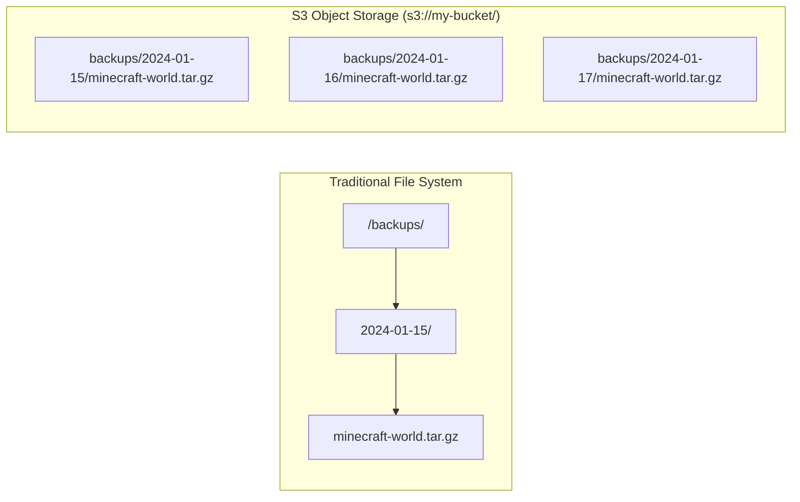

# AWS S3 — Technology Guide

> This guide explains what AWS S3 is, how it is configured for game server backups,
> and how to verify and restore from backups.
> No prior AWS experience required.

---

## What is AWS S3?

**Amazon S3 (Simple Storage Service)** is an **object storage** service provided by
Amazon Web Services (AWS). It allows you to store and retrieve any amount of data from
anywhere on the internet.

**What is object storage?**  
Unlike a file system (which has files in folders in folders), object storage stores
**objects** — each object has a key (path), data (content), and metadata. You access
objects via an API or URL, not by mounting a file system.



**Why S3 for backups?**
- **Durability:** S3 stores data across multiple availability zones (99.999999999% durability)
- **Versioning:** Keeps multiple versions of each object — accidentally overwrite a backup? Previous versions are still there
- **Cost-effective:** Pay only for what you store
- **Lifecycle rules:** Automatically move old backups to cheaper storage (Glacier) and delete very old ones

**References:**
- [AWS S3 documentation](https://docs.aws.amazon.com/s3/index.html)
- [AWS S3 getting started](https://aws.amazon.com/s3/getting-started/)
- [AWS S3 pricing](https://aws.amazon.com/s3/pricing/)

---

## S3 Bucket Configuration in This Homelab

The S3 bucket is created and configured by OpenTofu in `opentofu/s3.tf`.

### Key Configuration

| Setting | Value | Purpose |
|---------|-------|---------|
| Versioning | Enabled | Keep multiple versions of each backup |
| Encryption | AES-256 (SSE-S3) | All objects encrypted at rest |
| Public access | Blocked | No public access — private backup bucket |
| Lifecycle: Glacier transition | After 30 days | Move old backups to cheaper storage |
| Lifecycle: Expiration | After 90 days | Delete very old backups to save cost |

### Versioning

With versioning enabled, if a backup file is overwritten, the previous version is
retained. You can list and restore previous versions.

```bash
# List all versions of a specific backup file
aws s3api list-object-versions \
  --bucket <S3_BACKUP_BUCKET_NAME> \
  --prefix backups/minecraft-world.tar.gz \
  --region us-east-1
```

### Lifecycle Rules

```
Day 0-30:    Object stored in S3 Standard (fast access, higher cost)
Day 30-90:   Object transitioned to Glacier Instant Retrieval (slower access, lower cost)
Day 90+:     Object deleted
```

This ensures backups are retained for 90 days but old ones are cleaned up automatically.

---

## Backup Process

### What Gets Backed Up

The game server Minecraft world data is backed up:
```bash
# The backup script (deployed by Ansible)
tar -czf /tmp/minecraft-backup-$(date +%Y%m%d-%H%M%S).tar.gz \
  /home/minecraft/server/world/
```

### Backup Schedule

Configured by the `deploy_s3_backup.yml` Ansible playbook via a systemd timer.
Default schedule: `0 4 * * *` (4:00 AM daily).

```bash
# Check backup timer status on game server
ssh ubuntu@game-server.tailnet.ts.net
sudo systemctl status minecraft-backup.timer
sudo systemctl list-timers minecraft-backup.timer
```

### Manual Backup Trigger

```bash
# Via GitHub Actions:
# Actions → Ansible - Run Backup Now → Run workflow

# Or directly on the game server:
ssh ubuntu@game-server.tailnet.ts.net
sudo systemctl start minecraft-backup.service
```

---

## Verifying Backups

### Check Bucket Contents

```bash
# List all objects in the bucket
aws s3 ls s3://<S3_BACKUP_BUCKET_NAME>/ --region us-east-1 --recursive --human-readable

# Example output:
# 2024-01-15 04:02:15   45.2 MiB backups/minecraft-world-20240115-040000.tar.gz
# 2024-01-16 04:01:53   45.4 MiB backups/minecraft-world-20240116-040000.tar.gz
```

### Download and Verify a Backup

```bash
# Download the most recent backup
aws s3 cp \
  s3://<S3_BACKUP_BUCKET_NAME>/backups/minecraft-world-20240116-040000.tar.gz \
  /tmp/backup-test.tar.gz \
  --region us-east-1

# Verify it can be extracted
tar -tzf /tmp/backup-test.tar.gz | head -20
```

---

## Restoring from Backup

### Step 1: Download the Backup

```bash
# On the game server
ssh ubuntu@game-server.tailnet.ts.net

# List available backups
aws s3 ls s3://<S3_BACKUP_BUCKET_NAME>/backups/ --region us-east-1

# Download a specific backup
aws s3 cp \
  s3://<S3_BACKUP_BUCKET_NAME>/backups/minecraft-world-<date>.tar.gz \
  /tmp/minecraft-restore.tar.gz \
  --region us-east-1
```

### Step 2: Stop the Minecraft Server

```bash
sudo systemctl stop minecraft.service
```

### Step 3: Restore the World Data

```bash
# Back up current world (just in case)
sudo mv /home/minecraft/server/world /home/minecraft/server/world.old

# Extract the backup
sudo tar -xzf /tmp/minecraft-restore.tar.gz -C /
```

### Step 4: Restart the Minecraft Server

```bash
sudo systemctl start minecraft.service
sudo systemctl status minecraft.service
```

---

## AWS IAM Configuration

The game server and GitHub Actions use AWS IAM credentials to access S3.

**IAM user permissions needed:**

```json
{
  "Version": "2012-10-17",
  "Statement": [
    {
      "Effect": "Allow",
      "Action": [
        "s3:GetObject",
        "s3:PutObject",
        "s3:ListBucket",
        "s3:DeleteObject"
      ],
      "Resource": [
        "arn:aws:s3:::<bucket-name>",
        "arn:aws:s3:::<bucket-name>/*"
      ]
    }
  ]
}
```

### Rotating IAM Credentials

If credentials are compromised or need rotation:

1. Log in to [console.aws.amazon.com/iam](https://console.aws.amazon.com/iam)
2. Navigate to **Users** → your backup IAM user
3. Under **Security credentials**, click **Create access key**
4. Download or copy the new access key ID and secret
5. Update Bitwarden with the new credentials (`AWS_ACCESS_KEY_ID`, `AWS_SECRET_ACCESS_KEY`)
6. Update the Bitwarden Secrets Manager entries used by GitHub Actions
7. Deactivate and delete the old access key

---

## AWS CLI Quick Reference

```bash
# Configure AWS CLI with credentials
aws configure
# Prompts for: Access Key ID, Secret Access Key, region, output format

# Or set via environment variables
export AWS_ACCESS_KEY_ID="..."
export AWS_SECRET_ACCESS_KEY="..."

# List S3 buckets
aws s3 ls --region us-east-1

# List bucket contents
aws s3 ls s3://<bucket-name>/ --recursive --human-readable

# Upload a file
aws s3 cp /local/file.tar.gz s3://<bucket-name>/backups/ --region us-east-1

# Download a file
aws s3 cp s3://<bucket-name>/backups/file.tar.gz /local/ --region us-east-1

# Sync a directory to S3
aws s3 sync /local/dir/ s3://<bucket-name>/dir/ --region us-east-1

# Check bucket size
aws s3 ls s3://<bucket-name> --recursive --human-readable --summarize

# Get bucket versioning status
aws s3api get-bucket-versioning --bucket <bucket-name> --region us-east-1
```

---

## Common Troubleshooting

### Access denied errors

```bash
# Test credentials
aws sts get-caller-identity

# If this fails, credentials are wrong or expired
# Check BITWARDEN for correct values
```

### Backup not appearing in S3

```bash
# Check backup service logs on game server
ssh ubuntu@game-server.tailnet.ts.net
sudo journalctl -u minecraft-backup.service --since "24 hours ago"
```

### Bucket not found after OpenTofu apply

The S3 bucket may be in the wrong region. OpenTofu creates it in the region specified
by `aws_region` variable (default: `us-east-1`). Check with:
```bash
aws s3 ls --region us-east-1
```

If it doesn't appear, run `tofu apply` again to create it.
