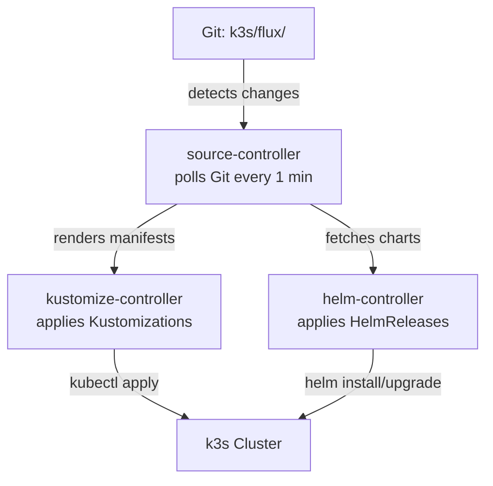

# Flux CD & GitOps — Technology Guide

> This guide explains what Flux CD is, how it reconciles your cluster state from Git,
> and the patterns used in this homelab for disaster recovery.
> No prior GitOps experience required.

---

## What is Flux CD?

**Flux CD** is an open-source **GitOps engine** for Kubernetes. It continuously
compares the desired state in this Git repository against the live cluster state,
automatically applying changes whenever Git is updated. This is the **single source
of truth** for everything running in the k3s cluster.

**The four Flux controllers:**

| Controller | Purpose |
|---|---|
| `source-controller` | Watches the Git repository and Helm chart repositories; detects new commits/releases |
| `kustomize-controller` | Reconciles `Kustomization` resources (applies Kustomize-templated manifests) |
| `helm-controller` | Reconciles `HelmRelease` resources (applies Helm charts with custom values) |
| `notification-controller` | (Optional) Sends alerts to Slack/webhooks when reconciliations fail |

All controllers run in the `flux-system` namespace and are installed during the bootstrap
procedure (see [05-flux-bootstrap.md](../05-flux-bootstrap.md)).

**Key principle:** Flux continuously runs a loop: **Git → source-controller → kustomize/helm-controller → cluster**. If you change anything in the cluster without changing Git, Flux will revert it on the next reconciliation (drift correction).

---

## Architecture in This Homelab

The Flux configuration is split into two layers:

### Layer 1: Bootstrap (the root Kustomization)

Located in `k3s/flux/clusters/k3s/`:

```
k3s/flux/clusters/k3s/
├── flux-system/                    # Generated by `flux bootstrap`
│   ├── gotk-components.yaml        # Flux controller deployments
│   ├── gotk-sync.yaml              # The root GitRepository + Kustomization
│   └── kustomization.yaml          # Ties everything together
├── apps.yaml                       # The root apps Kustomization
└── sources.yaml                    # HelmRepository definitions
```

When Flux bootstraps, it:
1. Installs the four controllers in the `flux-system` namespace (gotk-components)
2. Creates a `GitRepository` resource that points to this repo (gotk-sync)
3. Creates a root `Kustomization` (apps.yaml) that reconciles everything in `k3s/flux/apps/`

### Layer 2: Applications (per-service definitions)

Located in `k3s/flux/apps/`:

```
k3s/flux/apps/
├── kustomization.yaml             # "root of roots" — lists all active services
├── namespaces.yaml                # Namespace definitions
├── cert-manager.yaml              # HelmRelease (Helm chart operator)
├── cert-manager-config.yaml       # Kustomization (post-chart config)
├── authentik.yaml                 # HelmRelease (depends on cnpg-operator)
├── authentik-config.yaml          # Kustomization (post-chart config)
├── tailscale-operator.yaml        # HelmRelease
├── tailscale-config.yaml          # Kustomization
├── cloudflared.yaml               # Kustomization (plain manifests)
├── dashy.yaml                     # Kustomization (plain manifests)
├── jellyfin.yaml                  # Kustomization (plain manifests)
└── <other services>.yaml          # One Flux resource per service
```

Each service is **one or more Flux resources** (Kustomization or HelmRelease) that define what to deploy and where.
The `kustomization.yaml` file is the **single source of truth** for what is active — removing an entry disables that service.



---

## Kustomization vs HelmRelease Pattern

This homelab uses **two types** of Flux resources:

### Kustomization
**When:** Plain Kubernetes YAML manifests (no Helm chart)

Used for:
- Services deployed from raw manifests in `k3s/manifests/`
- Post-Helm configuration (e.g., cert-manager config, Traefik middleware)

```yaml
# Example: k3s/flux/apps/dashy.yaml
apiVersion: kustomize.toolkit.fluxcd.io/v1
kind: Kustomization
metadata:
  name: dashy
  namespace: flux-system
spec:
  interval: 10m
  sourceRef:
    kind: GitRepository
    name: flux-system
  path: ./k3s/manifests/dashy    # Points at plain manifests
  targetNamespace: dashy
```

### HelmRelease
**When:** Installing a Helm chart (e.g., from Jetstack, Tailscale, Authentik repos)

Used for:
- Operators and complex applications (cert-manager, Longhorn, Authentik, Tailscale)

```yaml
# Example: k3s/flux/apps/cert-manager.yaml
apiVersion: helm.toolkit.fluxcd.io/v2
kind: HelmRelease
metadata:
  name: cert-manager
  namespace: flux-system
spec:
  interval: 30m
  releaseName: cert-manager
  targetNamespace: cert-manager
  chart:
    spec:
      chart: cert-manager
      sourceRef:
        kind: HelmRepository
        name: jetstack
  values:
    installCRDs: true
```

**Dependency ordering:** Some services must be installed before others (e.g., CNPG before Authentik).
This is controlled via `dependsOn`:

```yaml
# Authentik depends on CNPG being installed first
spec:
  dependsOn:
    - name: cnpg-operator
```

---

## The "Patched Secrets" Pattern

Several `Secret` resources are committed to Git with **placeholder values** (`REPLACE_ME`).
At deploy time, they are patched out-of-band by the `k3s-patch-secrets.yml` GitHub Actions
workflow, which pulls real values from Bitwarden Secrets Manager.

### Why?

- **Git hygiene:** Secrets are never stored in plaintext in Git
- **Auditability:** Flux applies the initial placeholder, then GitHub Actions patches the live object
- **Server-Side Apply safety:** Using `kubectl patch --type=merge` (not `kubectl apply`) avoids
  conflicts with Flux's field-manager

### The annotation

All patched secrets carry this annotation:

```yaml
kustomize.toolkit.fluxcd.io/reconcile: disabled
```

**This tells kustomize-controller:** "Skip this object during reconciliation — never overwrite
it from Git." Otherwise, Flux would revert any out-of-band patch back to `REPLACE_ME` on the
next reconciliation.

### Current patched secrets

| Namespace     | Secret                           | Patched by workflow |
|---------------|----------------------------------|---------------------|
| `authentik`   | `authentik-credentials`          | `k3s-patch-secrets` |
| `cloudflared` | `cloudflared-tunnel-credentials` | `k3s-patch-secrets` |
| `mcp-proxmox` | `mcp-proxmox-secrets`            | `k3s-patch-secrets` |
| `stalwart`    | `stalwart-secrets`               | `k3s-patch-secrets` |
| `tailscale`   | `operator-oauth`                 | `k3s-patch-secrets` |

### Manual patching

If you need to update a secret during DR without GitHub Actions, use `kubectl patch` (not `apply`):

```bash
kubectl patch secret <name> -n <namespace> --type=merge \
  -p '{"stringData":{"key":"new-value"}}'
```

**Never use `kubectl apply`** — it will conflict with Flux's Server-Side Apply field-manager.

---

## Recovery Considerations

**Flux is fully reconstructible from Git.** The cluster's Flux state is entirely defined by this repository,
meaning:

1. **If Flux controllers crash:** Delete and re-bootstrap (see [05-flux-bootstrap.md](../05-flux-bootstrap.md))
2. **If the entire cluster is lost:** A fresh k3s cluster can be bootstrapped from this repo alone
3. **If secrets are lost:** Use the `k3s-patch-secrets.yml` workflow to re-populate (see [Phase 6](../06-secrets-restore.md))

**You do not need backups of Flux state itself** — it all lives in Git. The only things you need to preserve are:
- **Persisted application data** (databases, files) — backed up via PVCs and Longhorn snapshots
- **Secrets** — stored in Bitwarden Secrets Manager (not in Git)
- **This Git repository** — the single source of truth

---

## Common Operations

### Check reconciliation status

```bash
# List all Kustomizations across all namespaces
flux get kustomizations -A

# List all HelmReleases across all namespaces
flux get helmreleases -A

# View detailed status of a specific Kustomization
flux describe kustomization <name>

# View detailed status of a specific HelmRelease
flux describe helmrelease <name> -n flux-system
```

### Manually trigger reconciliation

```bash
# Force the Git source to check for new commits immediately
flux reconcile source git flux-system

# Force a specific Kustomization to reconcile
flux reconcile kustomization <name>

# Force a specific HelmRelease to reconcile
flux reconcile helmrelease <name> -n flux-system

# Re-reconcile the root apps Kustomization
flux reconcile kustomization apps -n flux-system
```

### View logs

```bash
# View logs from all Flux controllers in the last 10 minutes
flux logs --all-namespaces --since=10m

# View logs for a specific Kustomization
flux logs --kind=Kustomization --all-namespaces

# Follow logs in real time
flux logs --all-namespaces -f
```

### Temporarily disable a service

Remove its entry from `k3s/flux/apps/kustomization.yaml`, commit, and push.
Flux will prune the live resources on the next reconciliation (prune is enabled by default).

To re-enable: add the entry back and commit.

### Suspend and resume reconciliation

```bash
# Suspend reconciliation of a Kustomization (useful during manual troubleshooting)
flux suspend kustomization <name>

# Resume reconciliation
flux resume kustomization <name>

# Same for HelmReleases
flux suspend helmrelease <name> -n flux-system
flux resume helmrelease <name> -n flux-system
```

---

## Debugging Stuck Reconciliations

### Problem: Kustomization is stuck in `False` state

**First steps:**

```bash
# Get summary
flux get kustomizations -A | grep -i false

# Get details
flux describe kustomization <name>

# Get full logs
flux logs --kind=Kustomization <name>
```

**Common causes and fixes:**

| Cause | How to detect | How to fix |
|-------|---------------|-----------|
| Missing CRD | Logs show "CRD not found" or similar | Ensure dependency is installed first (use `dependsOn`) |
| Image pull failure | Logs show "ImagePullBackOff" | Check image registry access, credentials in secret |
| Missing secret | Logs show "Secret not found" | Ensure secret is patched (see Phase 6) or manually patch |
| Invalid YAML | Logs show "validation error" | Validate manifests locally with `kustomize build` |
| Network/DNS | Logs show "connection refused" or timeouts | Check cluster networking, Tailscale connectivity |

### Problem: HelmRelease stuck in `Pending`

```bash
flux describe helmrelease <name> -n flux-system
```

Usually means:
- A dependency (via `dependsOn`) hasn't finished installing
- The chart repo hasn't been fetched yet
- A CRD is missing

**Check dependencies:**

```bash
# List HelmReleases and their status
flux get helmreleases -A

# Check if a dependency is ready
flux describe helmrelease <dependency-name> -n flux-system
```

### Problem: Drift is not being reverted

Drift correction is enabled by default (`prune: true`, `wait: false`). If changes aren't being reverted:

1. Check for the `kustomize.toolkit.fluxcd.io/reconcile: disabled` annotation
2. If present, Flux is intentionally skipping that resource (likely a patched secret)
3. Make sure reconciliation is not suspended: `flux get kustomizations -A | grep -i suspend`

---

## Further Reading

- **[gitops-flux.md](../../gitops-flux.md)** — The canonical Flux operations guide (bootstrap, adding services, patching secrets)
- **[new-service.md](../../new-service.md)** — Full walkthrough for adding a new service (manifests, Authentik, ingress)
- **[05-flux-bootstrap.md](../05-flux-bootstrap.md)** — Bootstrap procedure in a disaster-recovery context
- **[06-secrets-restore.md](../06-secrets-restore.md)** — How to restore patched secrets from Bitwarden
- **[Flux official documentation](https://fluxcd.io/docs/)** — Authoritative reference
- **[Flux troubleshooting guide](https://fluxcd.io/docs/troubleshooting/)** — Comprehensive troubleshooting
