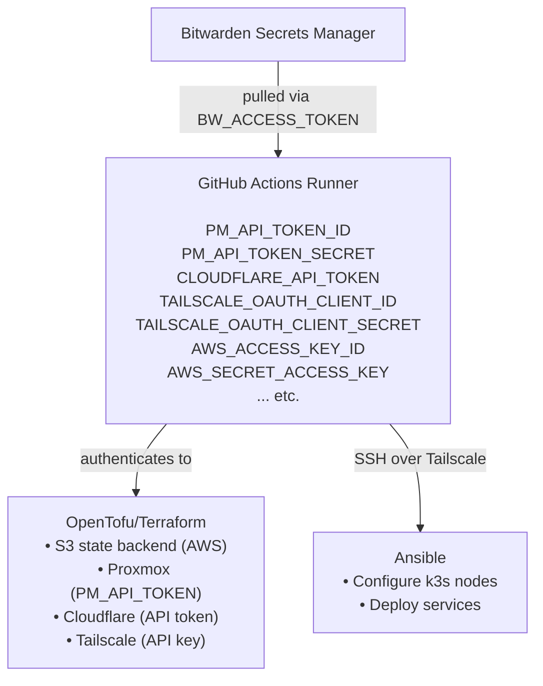

# GitHub Actions — Technology Guide

> This guide explains what GitHub Actions is, how the workflows in this homelab
> work, and how to use them for deployment and automation.
> No prior CI/CD experience required.

---

## What is GitHub Actions?

**GitHub Actions** is GitHub's built-in **CI/CD (Continuous Integration / Continuous
Deployment)** platform. It allows you to automate tasks that run in response to events
in your GitHub repository (like pushing code) or manually.

In this homelab, GitHub Actions workflows automate:

- Running OpenTofu to create/update infrastructure
- Running Ansible playbooks to configure servers
- Deploying Kubernetes manifests

**Why use GitHub Actions instead of running commands manually?**

- Secrets are managed centrally (Bitwarden SM → GitHub Actions)
- No need to install tools locally (OpenTofu, Ansible, kubectl)
- Reproducible — the same steps run the same way every time
- Audit trail — every workflow run is logged with inputs and outputs
- Safe — credentials are never exposed in logs (masked automatically)

**References:**

- [GitHub Actions documentation](https://docs.github.com/en/actions)
- [GitHub Actions quickstart](https://docs.github.com/en/actions/quickstart)
- [Workflow syntax reference](https://docs.github.com/en/actions/reference/workflow-syntax-for-github-actions)

---

## Key Concepts

### Workflow

A **workflow** is a YAML file stored in `.github/workflows/` that defines automated
processes. Each workflow has:

- **Triggers** — events that cause the workflow to run
- **Jobs** — groups of steps that run together
- **Steps** — individual commands or actions

### Triggers

Common triggers in this homelab:

```yaml
on:
  # Runs when code is pushed to main branch (only if opentofu/ files changed)
  push:
    branches: [main]
    paths: ["opentofu/**"]

  # Runs when a pull request is opened (for review)
  pull_request:
    branches: [main]
    paths: ["opentofu/**"]

  # Can be triggered manually from the GitHub UI
  workflow_dispatch:
    inputs:
      target_host:
        description: "Target hostname"
        required: true
```

`workflow_dispatch` is used for all Ansible workflows — they require manual trigger
because they need a `target_host` input.

### Jobs and Steps

```yaml
jobs:
  deploy:
    runs-on: ubuntu-latest # Run on GitHub's cloud runners
    steps:
      - name: Checkout code
        uses: actions/checkout@v6 # Clone the repository

      - name: Do something
        run: echo "Hello from CI" # Run a shell command
```

### Actions

**Actions** are reusable, pre-built steps. They are referenced with `uses:`:

| Action                       | What It Does                                 |
| ---------------------------- | -------------------------------------------- |
| `actions/checkout@v6`        | Clones the repository into the runner        |
| `bitwarden/sm-action@v2`     | Pulls secrets from Bitwarden Secrets Manager |
| `tailscale/github-action@v3` | Connects the runner to the Tailscale tailnet |
| `opentofu/setup-opentofu@v2` | Installs OpenTofu on the runner              |

### Secrets

GitHub Actions **repository secrets** are encrypted values stored in the repository
settings. They are injected as environment variables in workflows.

In this homelab, only ONE secret is stored directly in GitHub:

- `BW_ACCESS_TOKEN` — used to pull all other secrets from Bitwarden SM

All other secrets live in Bitwarden SM and are fetched at runtime.

---

## How to Trigger a Workflow Manually

1. Go to [github.com/hexabyte8/homelab](https://github.com/hexabyte8/homelab)
2. Click the **Actions** tab
3. Find the workflow in the left sidebar (e.g., "Ansible - Deploy k3s")
4. Click **Run workflow** on the right side
5. Fill in any required inputs
6. Click **Run workflow** button

---

## Reading Workflow Logs

When a workflow runs:

1. Click on the workflow run in the Actions tab
2. Click on a job name to expand it
3. Click on any step to see its output

**Important:** Sensitive values (secrets) are automatically replaced with `***` in logs.

### Job Summaries

Many workflows post a **job summary** — a formatted report shown at the bottom of the
workflow run page. These summaries include:

- What was applied
- Any errors
- Output from tools like `tofu plan`

---

## Common Issues

### Workflow fails at "Get Secrets" step

The `BW_ACCESS_TOKEN` GitHub secret is missing or invalid:

1. Check **Settings → Secrets and variables → Actions** that `BW_ACCESS_TOKEN` exists
2. Log in to Bitwarden SM and verify the token is not expired
3. Create a new token if needed and update the GitHub secret

### Tailscale connection fails

The OAuth client credentials have issues:

1. Check the Tailscale admin console for the CI OAuth client
2. Verify the credentials in Bitwarden SM are correct
3. Re-generate OAuth client credentials if needed

### Ansible "SSH connection failed"

1. Verify the target VM is online: check Tailscale admin console
2. Verify the VM hostname is correct in the workflow input
3. Check if cloud-init completed successfully on the VM:
   ```bash
   # Via Proxmox console
   sudo cat /var/log/cloud-init-output.log | tail -20
   ```

### Terraform plan shows unexpected changes

This can happen if:

1. Resources were modified outside Terraform
2. The Terraform state is out of sync with reality

Run `tofu plan` and review the output carefully before `tofu apply`.

### workflow_dispatch not available

If you don't see the **Run workflow** button:

1. Ensure you are on the `main` branch in the UI
2. Ensure the workflow file has `workflow_dispatch:` in its `on:` section
3. Wait a few minutes after pushing the workflow file — GitHub needs to index it

---

## Secrets Flow Summary


