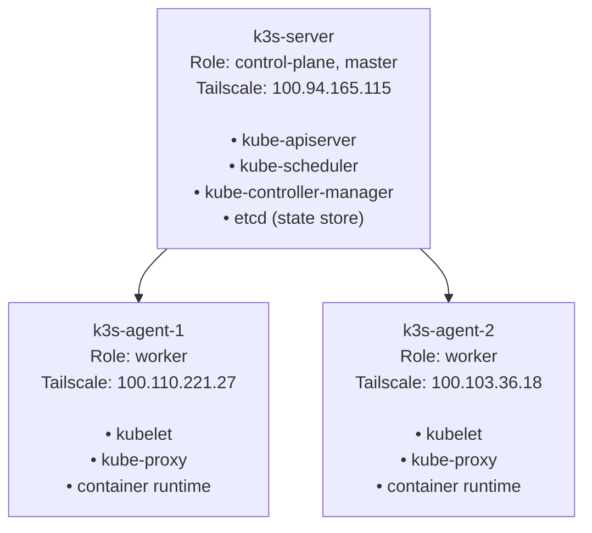

# Kubernetes / k3s — Technology Guide

> This guide explains what Kubernetes is, the key concepts you need to understand,
> and how k3s (the lightweight Kubernetes distribution) is configured in this homelab.
> No prior Kubernetes experience required.

---

## What is Kubernetes?

**Kubernetes** (often abbreviated **k8s**) is an open-source system for **automating the
deployment, scaling, and management of containerized applications**.

A **container** is a lightweight, portable package that contains an application and all
its dependencies. You can think of it like a shipping container — standardized, portable,
and isolated.

**What Kubernetes does:**
- Runs containers across multiple machines
- Restarts containers if they crash
- Scales containers up or down based on demand
- Routes network traffic to the right containers
- Stores application configuration and secrets
- Manages persistent storage for stateful applications

**Why not just run Docker directly?**  
Docker runs containers on a single machine. Kubernetes manages containers across a
*cluster* of machines, providing high availability and resource sharing.

**References:**
- [Kubernetes official documentation](https://kubernetes.io/docs/concepts/)
- [Kubernetes: What is Kubernetes? (video)](https://www.youtube.com/watch?v=PH-2FfFD2PU)
- [CNCF: Kubernetes explained](https://www.cncf.io/blog/2019/08/19/how-kubernetes-works/)

---

## What is k3s?

**k3s** is a lightweight, certified Kubernetes distribution created by Rancher Labs
(now SUSE). It is designed for:
- **Edge computing** and **resource-constrained environments** (like homelabs)
- **Simple installation** — a single binary, single command install
- **Low resource overhead** — uses less RAM and CPU than full Kubernetes

k3s is **fully compatible** with standard Kubernetes — all the same commands, APIs,
and tools work with k3s.

**k3s vs standard Kubernetes:**
| Feature | Standard Kubernetes | k3s |
|---------|--------------------|----|
| Installation | Complex, many components | Single binary, one command |
| RAM usage | 1+ GB per node | ~512 MB per node |
| Default storage | Manual setup | SQLite built-in (or etcd) |
| Default networking | Manual setup | Flannel included |
| Default load balancer | None | ServiceLB (Klipper) included |

**References:**
- [k3s official documentation](https://docs.k3s.io/)
- [k3s GitHub repository](https://github.com/k3s-io/k3s)
- [Rancher: k3s overview](https://www.rancher.com/products/k3s)

---

## Cluster Architecture

This homelab runs a **3-node k3s cluster**:



### Control Plane (k3s-server)

The control plane is the "brain" of the cluster:
- **kube-apiserver:** The REST API that all kubectl commands talk to
- **kube-scheduler:** Decides which node to run each pod on
- **kube-controller-manager:** Ensures the desired state matches actual state
- **etcd:** The distributed key-value store that holds all cluster state

### Worker Nodes (k3s-agent-1, k3s-agent-2)

Workers are the "muscles" — they actually run the workloads:
- **kubelet:** The agent that runs on every node, creates and manages pods
- **kube-proxy:** Handles network routing for services
- **Container runtime** (containerd): Actually runs the containers

---

## Core Kubernetes Concepts

### Pod

A **Pod** is the smallest deployable unit in Kubernetes. A pod contains one or more
containers that share the same network namespace and storage.

```yaml
# Example: a simple nginx pod
apiVersion: v1
kind: Pod
metadata:
  name: my-nginx
  namespace: default
spec:
  containers:
  - name: nginx
    image: nginx:latest
    ports:
    - containerPort: 80
```

### Deployment

A **Deployment** manages a set of identical pods, ensuring the desired number are always running:

```yaml
apiVersion: apps/v1
kind: Deployment
metadata:
  name: my-app
spec:
  replicas: 2          # Always keep 2 pods running
  selector:
    matchLabels:
      app: my-app
  template:            # Pod template
    metadata:
      labels:
        app: my-app
    spec:
      containers:
      - name: my-app
        image: my-app:v1.0
```

### Service

A **Service** provides a stable network endpoint for accessing pods (pods come and go,
but a service has a fixed IP/DNS name):

```yaml
apiVersion: v1
kind: Service
metadata:
  name: my-app-service
spec:
  selector:
    app: my-app        # Routes to pods with this label
  ports:
  - port: 80
    targetPort: 8080
  type: ClusterIP      # Only accessible within the cluster
```

**Service types:**
- **ClusterIP:** Internal cluster access only (default)
- **NodePort:** Accessible on each node's IP + a random port
- **LoadBalancer:** Gets an external IP (provided by MetalLB in this homelab)

### Namespace

A **Namespace** is a way to divide cluster resources between multiple users or projects:

```bash
# List all namespaces
kubectl get namespaces

# Commonly used in this homelab:
# flux-system   - Flux CD GitOps engine
# tailscale     - Tailscale Kubernetes operator
# metallb-system - MetalLB load balancer
# longhorn-system - Longhorn storage
# cnpg-system   - CloudNativePG operator
# kube-system   - Built-in Kubernetes components
```

### ConfigMap and Secret

- **ConfigMap:** Stores non-sensitive configuration as key-value pairs
- **Secret:** Stores sensitive data (passwords, tokens) — base64 encoded but not encrypted by default

```bash
# View all secrets in a namespace
kubectl get secrets -n tailscale

# View a specific secret (base64 encoded)
kubectl get secret operator-oauth -n tailscale -o yaml

# Decode a secret value
kubectl get secret operator-oauth -n tailscale \
  -o jsonpath='{.data.client_id}' | base64 -d
```

### Ingress

An **Ingress** is an API object that manages external access to services, typically HTTP/HTTPS:

```yaml
apiVersion: networking.k8s.io/v1
kind: Ingress
metadata:
  name: dashy-ingress
  annotations:
    tailscale.com/funnel: "false"
spec:
  ingressClassName: tailscale    # Use Tailscale ingress class
  rules:
  - host: dashy
    http:
      paths:
      - path: /
        pathType: Prefix
        backend:
          service:
            name: dashy
            port:
              number: 80
```

### PersistentVolume (PV) and PersistentVolumeClaim (PVC)

Kubernetes workloads that need to store data use **PersistentVolumes**:
- **PVC:** A request for storage (like asking for a specific size disk)
- **PV:** The actual storage allocation
- In this homelab, **Longhorn** provides the PVs when a PVC is created

---

## k3s Configuration in This Homelab

### Server Configuration (`/etc/rancher/k3s/config.yaml` on k3s-server)

```yaml
write-kubeconfig-mode: "644"    # Makes kubeconfig world-readable
tls-san:
  - "k3s-server"                # Valid hostnames for the API certificate
  - "100.94.165.115"            # Tailscale IP must be in the cert
node-ip: "100.94.165.115"       # Force k3s to use Tailscale IP
flannel-iface: tailscale0       # Flannel uses tailscale0 interface (not eth0)
```

### Agent Configuration (`/etc/rancher/k3s/config.yaml` on workers)

```yaml
node-ip: "100.x.x.x"           # Tailscale IP of this agent
node-external-ip: "100.x.x.x"  # Same Tailscale IP
flannel-iface: tailscale0       # Flannel uses tailscale0 interface
```

### Why Flannel Over Tailscale?

Flannel is the pod network that allows pods on different nodes to communicate.
It normally uses the primary network interface (which has the LAN/DHCP IP).

**Problem:** Home LAN IPs can change (DHCP). When they do, Flannel's VXLAN tunnel
breaks and pods lose connectivity.

**Solution:** Configure Flannel to use the `tailscale0` interface, which always
has a stable `100.x.x.x` IP that never changes.

---

## Essential kubectl Commands

```bash
# Basic cluster info
kubectl cluster-info
kubectl get nodes -o wide
kubectl get nodes --show-labels

# Working with pods
kubectl get pods -A                          # All pods in all namespaces
kubectl get pods -n <namespace>              # Pods in a specific namespace
kubectl describe pod <pod-name> -n <ns>      # Detailed pod info
kubectl logs <pod-name> -n <ns>             # Pod logs
kubectl logs <pod-name> -n <ns> -f          # Stream logs
kubectl exec -it <pod-name> -n <ns> -- /bin/sh  # Open shell in pod

# Working with deployments
kubectl get deployments -A
kubectl rollout status deployment/<name> -n <ns>
kubectl rollout restart deployment/<name> -n <ns>  # Restart all pods

# Working with services
kubectl get services -A
kubectl get svc -n <namespace>

# Working with secrets
kubectl get secrets -n <namespace>
kubectl create secret generic <name> \
  --from-literal=key=value -n <namespace>
kubectl patch secret <name> -n <ns> \
  --type='json' -p='[{"op":"replace","path":"/data/key","value":"<base64>"}]'

# Working with Flux Kustomizations
kubectl -n flux-system get kustomizations
kubectl -n flux-system describe kustomization <name>

# Debugging
kubectl describe node <node-name>           # Node details and events
kubectl top nodes                            # CPU/RAM usage per node
kubectl top pods -n <namespace>             # CPU/RAM usage per pod
kubectl get events -n <namespace> --sort-by='.lastTimestamp'
```

---

## Common k3s Troubleshooting

### k3s service not running

```bash
# Check status
sudo systemctl status k3s           # on server
sudo systemctl status k3s-agent     # on worker nodes

# View logs
sudo journalctl -u k3s -f
sudo journalctl -u k3s-agent -f
```

### Node not joining the cluster

```bash
# Check the k3s token on the server
sudo cat /var/lib/rancher/k3s/server/node-token

# On the agent, verify the token and server URL
sudo cat /etc/rancher/k3s/config.yaml
```

### Pods stuck in Pending

```bash
# Check why a pod isn't scheduled
kubectl describe pod <pod-name> -n <ns>
# Look at "Events" section at the bottom

# Check if nodes have resources available
kubectl describe node k3s-server | grep -A 10 "Allocatable"
```

### Flannel VXLAN issues

```bash
# Check if flannel.1 interface exists on a node
ip link show flannel.1

# Check Flannel logs
kubectl -n kube-system logs -l app=flannel --tail=50
```
