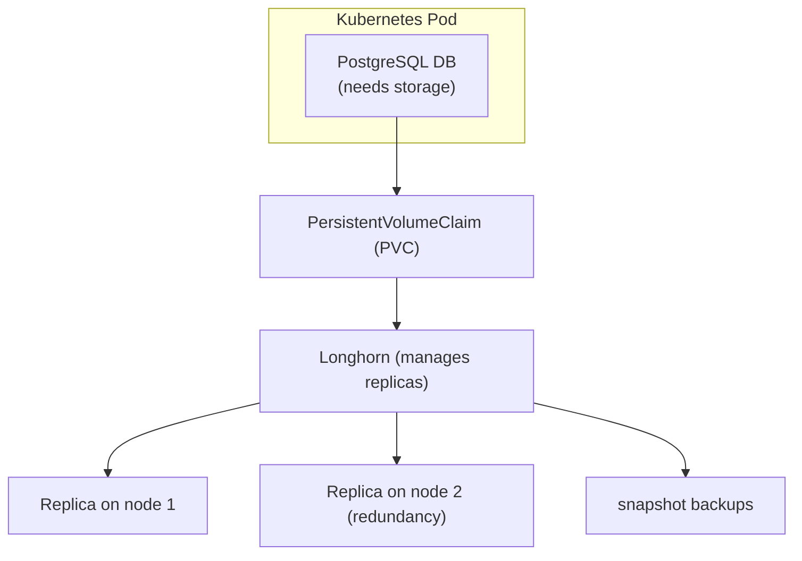
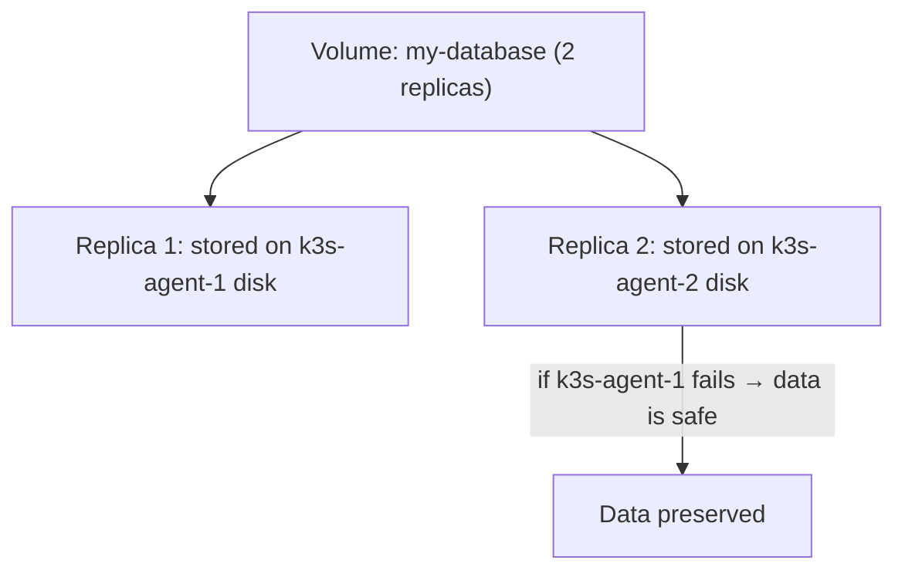

# Longhorn — Technology Guide

> This guide explains what Longhorn is, how it works, and how it provides persistent
> storage for Kubernetes workloads in this homelab.
> Basic understanding of Kubernetes is helpful but not required.

---

## What is Longhorn?

**Longhorn** is an open-source, distributed block storage system designed for Kubernetes.
It is developed by Rancher Labs (SUSE) and is the storage backend used for persistent
data in this homelab cluster.

**The problem Longhorn solves:**

Kubernetes containers are **ephemeral** — when a container restarts or moves to a
different node, any data it wrote to its local filesystem is lost. For applications
like databases, this is unacceptable.

Kubernetes solves this with **Persistent Volumes (PVs)** — network-attached storage
that persists across container restarts and can follow a container when it moves between nodes.

**What Longhorn provides:**

- Persistent block storage volumes
- Data replication across multiple nodes (so data survives a node failure)
- Automatic volume snapshots and backups
- Web UI for storage management
- Integration with Kubernetes PersistentVolumeClaim (PVC) API



**References:**

- [Longhorn official documentation](https://longhorn.io/docs/)
- [Longhorn GitHub repository](https://github.com/longhorn/longhorn)
- [Rancher: Longhorn overview](https://rancher.com/products/longhorn)

---

## Key Concepts

### Volumes

A Longhorn **volume** is a block device that can be mounted into a pod. Longhorn
stores volume data across multiple nodes for redundancy.

### Replicas

Each Longhorn volume has a configurable number of **replicas** — copies of the data
stored on different nodes. With 3 nodes and 2 replicas, data survives the loss of
one node.



### StorageClass

A Kubernetes **StorageClass** defines how volumes are provisioned. When an application
creates a PVC, Kubernetes uses the StorageClass to create the actual volume.

Longhorn installs as the default StorageClass. When any application requests a
PersistentVolumeClaim without specifying a class, Longhorn fulfills it.

### Snapshots and Backups

Longhorn supports:

- **Snapshots:** Point-in-time copies of a volume stored on the same disk (fast)
- **Backups:** Copies of snapshots stored in remote storage (S3, NFS) — used for disaster recovery

---

## How Longhorn is Used in This Homelab

### Deployment

Longhorn is managed by Flux CD as part of the GitOps workflow. Its manifests are in the
repository and applied automatically.

### Prerequisites

Before Longhorn can run, each node needs these packages installed (done via Ansible):

```bash
# Installed by ansible/playbooks/install_longhorn_prereqs.yml
apt install -y open-iscsi nfs-common util-linux
modprobe iscsi_tcp
```

**Why these packages?**

- `open-iscsi` — Longhorn uses iSCSI to mount volumes into pods
- `nfs-common` — for potential NFS-based backups
- `iscsi_tcp` — kernel module for iSCSI protocol

---

## Longhorn Web UI

If a Longhorn UI ingress is configured, you can access the Longhorn dashboard to:

- See all volumes and their health status
- View replica placement across nodes
- Create and manage snapshots
- Configure backup targets (S3)
- Monitor storage usage

---

## Common kubectl Commands for Longhorn

```bash
# Check Longhorn pods are running
kubectl get pods -n longhorn-system

# Check Longhorn nodes (should show all k3s nodes)
kubectl get nodes.longhorn.io -n longhorn-system

# View all Longhorn volumes
kubectl get volumes.longhorn.io -n longhorn-system

# View all PersistentVolumes in the cluster
kubectl get pv

# View all PersistentVolumeClaims
kubectl get pvc -A

# Describe a volume for troubleshooting
kubectl describe volume.longhorn.io <name> -n longhorn-system
```

---

## Common Troubleshooting

### Pod stuck in Pending — no volumes available

```bash
# Check if the PVC is bound
kubectl get pvc -n <namespace>
# If status is "Pending", the volume hasn't been created yet

# Check Longhorn volumes
kubectl get volumes.longhorn.io -n longhorn-system
# If volume is "detached", it needs to be attached to a node

# Check if Longhorn manager pods are running on the nodes
kubectl get pods -n longhorn-system -l app=longhorn-manager
```

### Volume degraded (replica missing)

This happens if a node was down and a replica was lost:

```bash
# Check replica status
kubectl get replicas.longhorn.io -n longhorn-system

# Longhorn will automatically rebuild replicas when nodes come back online
# Monitor the rebuild progress in the Longhorn UI or:
kubectl describe volume.longhorn.io <name> -n longhorn-system | grep -i rebuild
```

### open-iscsi not running

If Longhorn volumes fail to mount, check iSCSI is working:

```bash
# On the affected node
sudo systemctl status iscsid
sudo systemctl start iscsid
sudo systemctl enable iscsid

# Check iscsi_tcp kernel module is loaded
lsmod | grep iscsi_tcp
# If not loaded:
sudo modprobe iscsi_tcp
```

---

## Storage Planning

Current node disk allocation:

- k3s-server: 50 GB total
- k3s-agent-1: 50 GB total
- k3s-agent-2: 50 GB total

Longhorn uses a portion of each node's disk for volume storage. The remaining space
is used by the OS, k3s, container images, etc.

**Recommended:** Allocate at least 20–30 GB per node to Longhorn for a 3-node cluster
with default 2-replica volumes.
