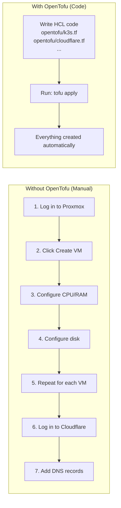
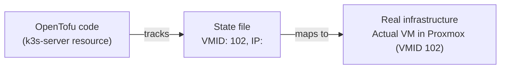

# OpenTofu — Technology Guide

> This guide explains what OpenTofu is, how it works, and how it is used in
> this homelab. No prior infrastructure-as-code experience required.

---

## What is OpenTofu?

**OpenTofu** is an open-source **Infrastructure as Code (IaC)** tool (a community fork of Terraform, maintained by the Linux Foundation). Instead
of manually clicking through web interfaces to create servers, DNS records, and cloud
resources, you write **code** that describes what you want, and OpenTofu creates it
automatically.

**Why this matters for disaster recovery:**
- All infrastructure is defined in `.tf` files in the GitHub repository
- Running `tofu apply` recreates everything from scratch in minutes
- No manual clicking, no forgotten steps, no human error



**References:**
- [OpenTofu official website](https://opentofu.org/)
- [OpenTofu documentation](https://opentofu.org/docs/)
- [OpenTofu GitHub repository](https://github.com/opentofu/opentofu)

---

## Key Concepts

### Providers

OpenTofu uses **providers** — plugins that know how to talk to specific APIs.

This homelab uses these providers:

| Provider | What It Manages |
|----------|----------------|
| `proxmox` (telmate) | Creates and manages Proxmox VMs |
| `cloudflare` | Creates and manages Cloudflare DNS records |
| `tailscale` | Creates Tailscale auth keys and ACL policies |
| `aws` | Creates and manages the S3 backup bucket |
| `null` | Runs local commands (e.g., SSH to write the cloud-init snippet) |

Providers are configured in `opentofu/main.tf`:
```hcl
terraform {
  required_providers {
    proxmox = {
      source  = "telmate/proxmox"
      version = "3.0.2-rc04"
    }
    cloudflare = {
      source  = "cloudflare/cloudflare"
      version = "~> 5"
    }
    ...
  }
}
```

### Resources

A **resource** is a thing that OpenTofu creates and manages. Each resource has a type
(from a provider) and a name:

```hcl
resource "proxmox_vm_qemu" "k3s-server" {
#         ^provider_type  ^resource_name
  name   = "k3s-server"
  memory = 8192
  ...
}
```

### State

OpenTofu maintains a **state file** that records what it has already created. The state
is like a map between the code and the real-world resources.



**In this homelab:** The state is stored in an **AWS S3 bucket** (`chronobyte-homelab-tf-state`) — the state backend.
State locking is provided by a **DynamoDB table** (`homelab-tf-state-lock`).
This means the state persists even if the physical server is destroyed — which is
exactly what makes disaster recovery possible!

### Plan and Apply

Terraform works in two steps:

1. **`tofu plan`** — compares current state with desired code, shows what will change
   (no modifications made yet)
2. **`tofu apply`** — executes the changes shown in the plan

Always run `tofu plan` before `tofu apply` to review changes.

### Variables

Terraform uses **variables** to avoid hardcoding sensitive values in the code:

```hcl
# variables.tf — declares that a variable exists
variable "default_vm_password" {
  description = "Console password for VMs"
  type        = string
  sensitive   = true
}

# k3s.tf — uses the variable
resource "proxmox_vm_qemu" "k3s-server" {
  cipassword = var.default_vm_password
  ...
}
```

Variables are passed via:
- `terraform.auto.tfvars` files (auto-loaded, should NOT be committed)
- Environment variables: `TF_VAR_<variable_name>`
- Interactive prompts when running `tofu apply`

### Outputs

Terraform can **output** values after applying, like an IP address or a generated key:

```hcl
output "tailscale_auth_key" {
  value     = tailscale_tailnet_key.vm_auth.key
  sensitive = true
}
```

---

## How OpenTofu is Used in This Homelab

### File Structure

```
opentofu/
├── main.tf              # Provider configuration and S3 backend
├── variables.tf         # All input variable definitions
├── k3s.tf               # 3 k3s VMs (server + 2 agents)
├── games.tf             # Game server VM
├── cloudflare.tf        # DNS records for all services
├── tailscale.tf         # Tailscale auth key and ACL policy
├── s3.tf                # AWS S3 backup bucket
├── proxmox-snippets.tf  # Uploads the cloud-init snippet via SSH
└── templates/
    └── main.yaml.tpl    # Cloud-init template (Tailscale install script)
```

### S3 Backend (State Storage)

The `main.tf` configures AWS S3 as the remote backend for state storage:

```hcl
backend "s3" {
  bucket         = "chronobyte-homelab-tf-state"
  key            = "homelab/terraform.tfstate"
  region         = "us-east-1"
  encrypt        = true
  dynamodb_table = "homelab-tf-state-lock"
}
```

This means:
- The state file is stored in `s3://chronobyte-homelab-tf-state/homelab/terraform.tfstate`
- State locking is provided by the DynamoDB table `homelab-tf-state-lock` — only one run at a time
- State is never lost when hardware fails
- Authentication uses the same `AWS_ACCESS_KEY_ID` / `AWS_SECRET_ACCESS_KEY` as the backup bucket

### GitHub Actions Integration

The `opentofu-apply.yml` and `opentofu-plan.yml` workflows automate OpenTofu:

1. Secrets are pulled from Bitwarden at runtime
2. Tailscale is connected so the runner can reach Proxmox
3. `tofu init` downloads providers and connects to the S3 backend
4. `tofu apply -auto-approve` applies all changes

This means **you never need to run OpenTofu locally** for normal operations.

---

## Common OpenTofu Commands

```bash
# Initialize OpenTofu (download providers, connect to backend)
tofu init

# Preview changes (does not modify anything)
tofu plan

# Apply changes (creates/modifies/destroys resources)
tofu apply

# Apply without interactive prompt
tofu apply -auto-approve

# Destroy all resources (use with extreme caution!)
tofu destroy

# Show current state
tofu show

# List all resources in state
tofu state list

# Import an existing resource into state
tofu import proxmox_vm_qemu.k3s-server chronobyte/qemu/102

# Remove a resource from state (does not destroy the resource)
tofu state rm proxmox_vm_qemu.k3s-server

# Validate syntax
tofu validate

# Format code
tofu fmt
```

---

## Common Troubleshooting

### Error: No valid credential sources found

The provider credentials are not set. Make sure environment variables are exported:
```bash
export PM_API_TOKEN_ID="..."
export PM_API_TOKEN_SECRET="..."
export CLOUDFLARE_API_TOKEN="..."
# etc.
```

### Error: Failed to query available provider packages

OpenTofu cannot reach the registry. Check internet connectivity:
```bash
curl -I https://registry.opentofu.org
```

### Error: 401 Unauthorized (Proxmox)

The Proxmox API token is wrong or expired. Verify:
- `PM_API_TOKEN_ID` format: `user@pam!tokenname`
- Token has the correct permissions in Proxmox
- Token secret matches what's in Bitwarden

### Error: Provider produced inconsistent result after apply

A resource was created but the API returned different data than expected. Usually safe to
run `tofu apply` again — it will reconcile the state.

### State is locked

If a previous run was interrupted, the state may be locked:
```bash
tofu force-unlock <LOCK_ID>
```

The lock ID is shown in the error message.
