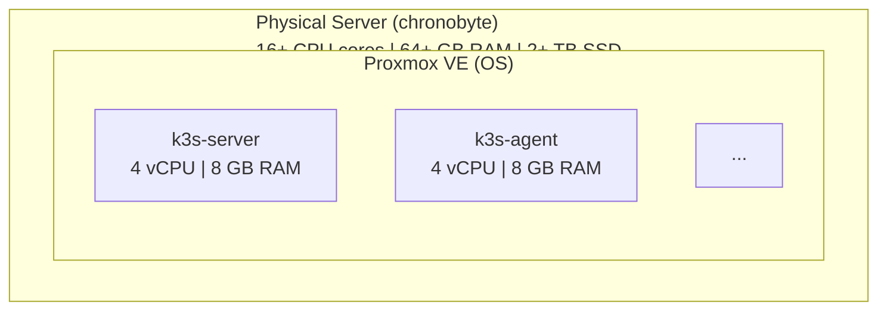
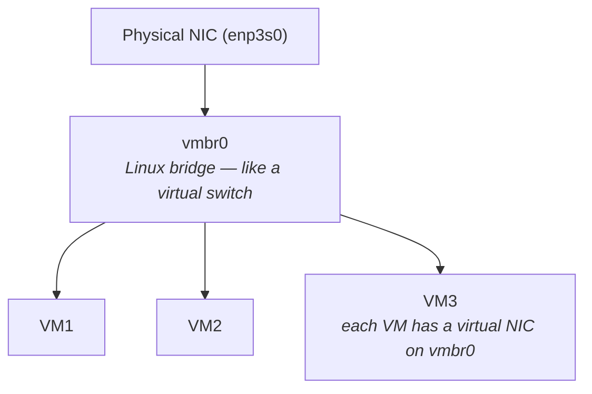

# Proxmox VE — Technology Guide

> This guide explains what Proxmox VE is, how it works, and how it is used in
> this homelab. No prior virtualization experience required.

---

## What is Proxmox VE?

**Proxmox Virtual Environment (VE)** is a free, open-source **hypervisor** — a type
of operating system that runs directly on bare metal hardware and allows you to create
and manage **virtual machines (VMs)** and **containers**.

Think of it this way:
- Your physical server (`chronobyte`) has a lot of CPU cores, RAM, and storage
- Proxmox runs on that physical server
- Proxmox divides the physical resources among multiple virtual machines
- Each virtual machine acts like a completely independent computer



**References:**
- [Proxmox VE official website](https://www.proxmox.com/en/proxmox-virtual-environment/overview)
- [Proxmox VE documentation](https://pve.proxmox.com/pve-docs/)
- [Proxmox community forum](https://forum.proxmox.com/)

---

## Key Concepts

### Hypervisor Types

There are two types of hypervisors:
- **Type 1 (bare-metal):** Runs directly on hardware — Proxmox is this type
- **Type 2 (hosted):** Runs inside another OS — VMware Workstation, VirtualBox are this type

Type 1 hypervisors are more efficient because there is no overhead of a "host" OS.

### Virtual Machines vs Containers

Proxmox supports both:
- **VMs (QEMU/KVM):** Full hardware emulation — each VM has its own kernel, can run any OS
- **LXC containers:** Lighter weight, shares the host kernel — faster but less isolated

This homelab uses **VMs only**, not LXC containers. VMs are used because they offer
complete isolation and can run Ubuntu, which is what k3s expects.

### QEMU/KVM

Proxmox uses **KVM** (Kernel-based Virtual Machine), a Linux kernel feature that
allows hardware virtualization, combined with **QEMU** for device emulation.

- **KVM** provides near-native CPU performance by running VM code directly on the CPU
- **QEMU** emulates virtual hardware: network cards, disk controllers, etc.

### VM Template

A VM template is a "read-only golden image" that you clone to create new VMs quickly.

In this homelab, **VM 9000** is the template:
1. A fresh Ubuntu 24.04 cloud image is imported
2. It is configured with a cloud-init drive (for automatic configuration)
3. The VM is converted to a template

When OpenTofu needs to create a new VM, it clones VM 9000 — this is much faster
(seconds) than installing Ubuntu from scratch (minutes).

### Cloud-Init

Cloud-init is a tool installed in cloud images that reads configuration from a
special drive attached to the VM on first boot. Proxmox creates a "cloud-init drive"
that passes configuration to the VM.

This homelab's cloud-init configuration:
1. Sets the hostname, IP address, and user password
2. Runs startup scripts (installing Tailscale, configuring the system)

**Reference:** [Proxmox Cloud-Init guide](https://pve.proxmox.com/wiki/Cloud-Init_Support)

---

## How Proxmox is Used in This Homelab

### 4 Virtual Machines

| VM | VMID | Purpose | Resources |
|----|------|---------|-----------|
| k3s-agent-1 | 101 | Kubernetes worker | 4 vCPU, 8 GB RAM, 50 GB disk |
| k3s-server | 102 | Kubernetes control plane | 4 vCPU, 8 GB RAM, 50 GB disk |
| k3s-agent-2 | 103 | Kubernetes worker | 4 vCPU, 8 GB RAM, 50 GB disk |
| game-server | 104 | Minecraft server | 4 vCPU, 16 GB RAM, 500 GB disk |

All VMs are cloned from **VM 9000** (Ubuntu 24.04 template) using OpenTofu.

### Network Configuration

Proxmox creates a **Linux bridge** called `vmbr0`:



VMs connect to `vmbr0` and can reach the LAN and internet through the physical NIC.

### Storage

Proxmox uses **local-lvm** (LVM thin provisioning) to store VM disks. Each VM disk
is a logical volume within the LVM volume group.

```bash
# On Proxmox host, list all VM disks
lvs | grep vm-
```

---

## Important Proxmox CLI Commands

Run these in the Proxmox shell (via web UI → Shell, or SSH to Proxmox host):

```bash
# List all VMs
qm list

# Show VM status
qm status <vmid>

# Start a VM
qm start <vmid>

# Stop a VM (graceful)
qm shutdown <vmid>

# Show VM configuration
qm config <vmid>

# Connect to VM console (serial console for cloud-init VMs)
qm terminal <vmid>

# Destroy a VM and delete its disks
qm destroy <vmid> --purge

# Create a VM template from an existing VM
qm template <vmid>

# Clone a VM from a template
qm clone <template-vmid> <new-vmid> --name <name> --full

# Get storage info
pvesm status
pvesm list local-lvm
```

---

## Proxmox Web UI Overview

Access the web UI at `https://192.168.1.10:8006`

**Key sections:**

| Location | What It Does |
|----------|-------------|
| Datacenter → chronobyte | Node overview, resource usage |
| chronobyte → [VM] | VM-specific management (start/stop, console, hardware) |
| Datacenter → Storage | Manage storage (enable snippets here) |
| Datacenter → Permissions → API Tokens | Create/manage API tokens for OpenTofu |
| Datacenter → Network | Network bridge configuration |
| [Node] → Shell | Web-based terminal to the Proxmox host |

---

## Common Troubleshooting

### VM won't start
```bash
# Check VM configuration for errors
qm config <vmid>

# Check Proxmox host system logs
journalctl -u pvedaemon --since "1 hour ago"
```

### VM is stuck or unresponsive
```bash
# Force stop (like pulling the power plug)
qm stop <vmid>

# Connect to serial console to see what's happening
qm terminal <vmid>
```

### Cloud-init didn't run
```bash
# Via Proxmox console to the VM
sudo cat /var/log/cloud-init.log
sudo cat /var/log/cloud-init-output.log
```

### Storage is full
```bash
# Show storage usage
df -h
pvesm status

# Find large files
find /var/lib/vz -size +1G -ls
```

---

## Proxmox API

OpenTofu uses the Proxmox API to create and manage VMs. The API is available at:
```
https://chronobyte.tailnet.ts.net:8006/api2/json
```

The API uses token-based authentication. The token ID and secret are stored in Bitwarden
as `PM_API_TOKEN_ID` and `PM_API_TOKEN_SECRET`.

**Reference:** [Proxmox API documentation](https://pve.proxmox.com/pve-docs/api-viewer/)
