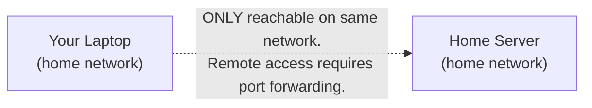
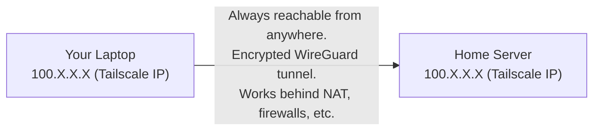

# Tailscale — Technology Guide

> This guide explains what Tailscale is, how it works, and how it is used throughout
> this homelab for private networking, SSH access, and service exposure.
> No prior VPN or networking experience required.

---

## What is Tailscale?

**Tailscale** is a modern, easy-to-use **VPN (Virtual Private Network)** built on top
of the **WireGuard** protocol. It creates an encrypted private network (called a
**tailnet**) between all your devices, regardless of where they are in the world.

**Without Tailscale:**


**With Tailscale:**


**References:**
- [Tailscale official documentation](https://tailscale.com/kb/)
- [Tailscale: How it works](https://tailscale.com/blog/how-tailscale-works)
- [WireGuard protocol](https://www.wireguard.com/)
- [Tailscale vs traditional VPN](https://tailscale.com/compare/vpn/)

---

## Key Concepts

### Tailnet

A **tailnet** is your private Tailscale network. All devices in the tailnet can
communicate with each other using stable `100.x.x.x` IP addresses.

This homelab uses the tailnet `tailnet.ts.net`.

### MagicDNS

Tailscale's **MagicDNS** assigns each device a DNS hostname based on its name.
For example, a machine named `k3s-server` in tailnet `tailnet.ts.net`
gets the hostname `k3s-server.tailnet.ts.net`.

This means you can SSH to `ubuntu@k3s-server.tailnet.ts.net` from anywhere
without memorizing IP addresses.

### Tailscale SSH

When a device is enrolled with `--ssh`, Tailscale's SSH feature allows passwordless
SSH access to that machine using your Tailscale identity — no SSH keys required.

All VMs in this homelab have Tailscale SSH enabled. This is why Ansible workflows
can SSH to them without managing SSH key files.

### ACL (Access Control Lists)

Tailscale ACLs define who can connect to what. The homelab ACL is managed by Terraform
in `opentofu/tailscale.tf`. Key tags used:

| Tag | Who Uses It | What It Can Access |
|-----|------------|-------------------|
| `tag:server` | All VMs (Proxmox host, k3s nodes, game server) | Can SSH to each other |
| `tag:ci` | GitHub Actions runners | Can reach Proxmox API and k3s nodes |
| `tag:k8s-operator` | Kubernetes Tailscale operator devices | Can expose services |
| `tag:k8s-operator-proxy` | Individual service proxy devices | Can expose specific services |

### Auth Keys vs OAuth Clients

Tailscale uses different credential types for different purposes:

| Type | Format | Used For |
|------|--------|---------|
| API key | `tskey-api-...` | Terraform provider (manages tailnet config) |
| Auth key | `tskey-auth-...` | VMs joining the tailnet (generated by Terraform) |
| OAuth client | ID + secret | GitHub Actions (connecting to tailnet temporarily) |
| OAuth client | ID + secret | Kubernetes Tailscale operator (managing devices) |

---

## How Tailscale is Used in This Homelab

### 1. VM Provisioning (via Cloud-Init)

When Terraform creates VMs, each VM automatically joins the tailnet on first boot
via the cloud-init script:

```bash
# Runs on every VM on first boot
tailscale up --auth-key=<key> --advertise-tags=tag:server --ssh
```

The auth key is created by OpenTofu in `opentofu/tailscale.tf` — it is reusable,
pre-authorized (no approval needed), and expires after 90 days.

### 2. GitHub Actions Connectivity

Every GitHub Actions workflow that needs to reach the homelab connects via Tailscale:

```yaml
# In each GitHub Actions workflow:
- name: Connect to Tailscale
  uses: tailscale/github-action@v3
  with:
    oauth-client-id: ${{ env.TAILSCALE_OAUTH_CLIENT_ID }}
    oauth-secret: ${{ env.TAILSCALE_OAUTH_CLIENT_SECRET }}
    tags: tag:ci
```

This creates a temporary Tailscale device for the duration of the workflow, allowing
the runner to SSH into VMs and reach the Proxmox API.

### 3. Kubernetes Service Exposure (Tailscale Operator)

The **Tailscale Kubernetes Operator** runs inside k3s and watches for services/ingresses
annotated with Tailscale settings. When it sees one, it creates a Tailscale device
that proxies traffic to that Kubernetes service.

This is how the Dashy dashboard is exposed:

```yaml
# k3s/flux/apps/dashy.yaml (Flux Kustomization points here)
# k3s/manifests/dashy/ingress.yaml
apiVersion: networking.k8s.io/v1
kind: Ingress
metadata:
  name: dashy
  namespace: dashy
spec:
  ingressClassName: tailscale    # ← tells the Tailscale operator to handle this
  rules:
  - host: dashy
    http:
      paths:
      - path: /
        ...
```

When Flux applies this ingress, the Tailscale operator:
1. Creates a new Tailscale device named `dashy`
2. The device appears in the admin console at `dashy.tailnet.ts.net`
3. Traffic to `https://dashy.tailnet.ts.net` is proxied to the Dashy service

### 4. Public Internet Exposure (Tailscale Funnel)

**Tailscale Funnel** allows selected Kubernetes services to be reached by anyone on the
internet — not just tailnet members — at `https://<hostname>.tailnet.ts.net`.

It is enabled per-resource by adding `tailscale.com/funnel: "true"` to an Ingress or
Service and referencing the `funnel` ProxyClass. The Tailscale ACL in
`opentofu/tailscale.tf` already grants the `funnel` capability to `tag:k8s` proxy
devices so no manual ACL changes are needed when adding a new Funnel-exposed service.

See [Tailscale Operator — Method 4](../../tailscale-operator.md#method-4-tailscale-funnel-public-internet-exposure)
for full usage instructions and examples.

### 5. Flannel Overlay Network

k3s's Flannel networking is configured to use the `tailscale0` interface instead
of the LAN interface. This ensures pod networking uses stable Tailscale IPs
(`100.x.x.x`) rather than potentially-changing LAN IPs.

See [Flannel over Tailscale](../flannel-over-tailscale.md) for full details.

---

## Tailscale Admin Console

Access the admin console at [login.tailscale.com/admin](https://login.tailscale.com/admin).

**Key sections:**

| Section | What You'll Find |
|---------|----------------|
| Machines | All enrolled devices (VMs, your laptop, Tailscale proxy pods) |
| DNS | MagicDNS settings, custom nameservers |
| Access Controls | ACL policy editor (also managed by Terraform) |
| Settings → OAuth clients | OAuth clients for GitHub Actions and k8s operator |
| Settings → Keys | Auth keys for VM enrollment |

---

## Tailscale CLI Reference

```bash
# Check what Tailscale version is installed
tailscale version

# Check connection status and see all devices
tailscale status

# Get the current device's Tailscale IP
tailscale ip -4

# Connect to the tailnet (prompts for authentication if needed)
tailscale up

# Connect with specific options
tailscale up --ssh --advertise-tags=tag:server

# Connect using an auth key (non-interactive, for scripts)
tailscale up --auth-key=tskey-auth-...

# Disconnect from the tailnet
tailscale down

# Check tailnet connectivity to a specific host
tailscale ping k3s-server

# View logs
sudo journalctl -u tailscaled -f
```

---

## Tailscale Kubernetes Operator

The Tailscale Kubernetes Operator is deployed in the `tailscale` namespace via Helm chart.

**Components:**

| Component | Purpose |
|-----------|---------|
| `operator` deployment | Main controller that watches Kubernetes resources |
| `ProxyClass` (`prod`) | Configuration template for all proxy devices |
| `operator-oauth` secret | OAuth credentials (applied manually in Phase 6) |

**Checking operator status:**
```bash
# View operator pods
kubectl -n tailscale get pods

# View operator logs
kubectl -n tailscale logs -l app=operator --tail=50

# View devices managed by the operator
kubectl -n tailscale get tailscaledevices

# View all Tailscale proxy pods (one per exposed service)
kubectl -n tailscale get pods -l tailscale.com/parent-resource-type=Service
```

**Three ways to expose a Kubernetes service via Tailscale:**

1. **Annotated Service** — for simple TCP/UDP exposure:
   ```yaml
   apiVersion: v1
   kind: Service
   metadata:
     annotations:
       tailscale.com/expose: "true"
   spec:
     type: ClusterIP
   ```

2. **LoadBalancer Service** — for IP-based access:
   ```yaml
   spec:
     type: LoadBalancer
     loadBalancerClass: tailscale
   ```

3. **Tailscale Ingress** — for HTTP/HTTPS services (recommended):
   ```yaml
   spec:
     ingressClassName: tailscale
   ```

4. **Tailscale Funnel** — to expose a service on the **public internet** (not just the tailnet). Requires `tailscale.com/funnel: "true"` annotation and the `funnel` ProxyClass:
   ```yaml
   metadata:
     annotations:
       tailscale.com/funnel: "true"
       tailscale.com/proxy-class: "funnel"
   spec:
     ingressClassName: tailscale
   ```
   The ACL in `opentofu/tailscale.tf` already grants the `funnel` attribute to `tag:k8s` devices.

**Reference:** [Tailscale Kubernetes operator documentation](https://tailscale.com/kb/1236/kubernetes-operator)

---

## Common Troubleshooting

### Device not appearing in admin console

```bash
# Check if tailscaled is running
sudo systemctl status tailscaled

# Check authentication
tailscale status
# If showing "Logged out" or "NeedsLogin":
tailscale up
```

### SSH connection refused via Tailscale

```bash
# Verify Tailscale SSH is enabled on the target device
tailscale status | grep <hostname>
# Should show "ssh" in the capabilities

# Check if the device is online in the admin console
tailscale ping <device-name>
```

### Tailscale operator auth errors

Check the OAuth secret was applied correctly:
```bash
kubectl get secret operator-oauth -n tailscale \
  -o jsonpath='{.data.client_id}' | base64 -d
# Should show the actual OAuth client ID, not "REPLACE_ME"
```

If it shows `REPLACE_ME`, complete [Phase 6: Secrets Restore](../06-secrets-restore.md).

### GitHub Actions can't connect

```bash
# In the workflow, check the tailscale/github-action step logs
# Common issues:
# 1. OAuth credentials expired — regenerate in Tailscale admin console
# 2. `tag:ci` tag not in ACL — check tailscale.tf and run tofu apply
```
