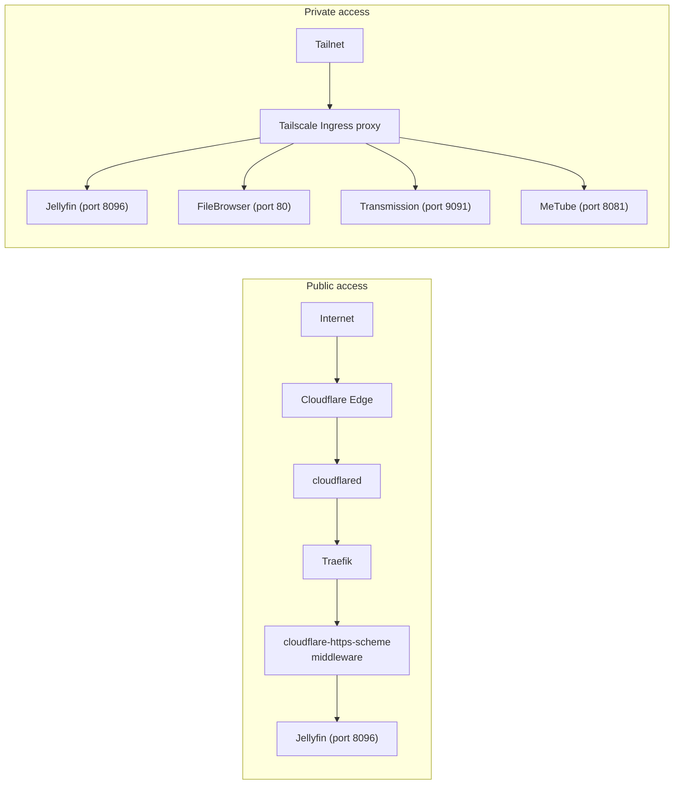
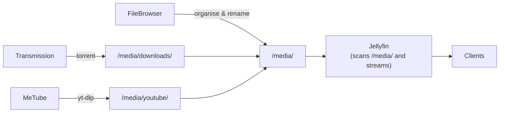

# Jellyfin Media Suite

The `jellyfin` namespace hosts a collection of media-related services that work together: Jellyfin streams media, FileBrowser manages files, Transmission downloads torrents over a VPN, and MeTube pulls YouTube videos. Calibre-Web (ebook library) also runs in this namespace — see [calibre-web.md](calibre-web.md).

## Services overview

| Service | Image | Purpose | LAN IP |
|---------|-------|---------|--------|
| Jellyfin | `jellyfin/jellyfin:10.10.7` | Media server and streaming | `<jellyfin-lan-ip>` |
| FileBrowser | `filebrowser/filebrowser:v2.31.2` | Web file manager | `<filebrowser-lan-ip>` |
| Transmission | `haugene/transmission-openvpn:5.3` | BitTorrent client (VPN-tunnelled) | `<transmission-lan-ip>` |
| MeTube | `ghcr.io/alexta69/metube:2026.03.21` | yt-dlp web UI (YouTube downloader) | — |

## Access

| Service | Private (tailnet) | Public (Cloudflare) |
|---------|-------------------|---------------------|
| Jellyfin | `https://jellyfin.tailnet.ts.net` | `https://jellyfin.example.com` |
| FileBrowser | `https://jellyfin-files.tailnet.ts.net` | — |
| Transmission | `https://jellyfin-transmission.tailnet.ts.net` | — |
| MeTube | `https://jellyfin-ytdl.tailnet.ts.net` | — |

## Architecture



Jellyfin, FileBrowser, and Transmission are also exposed as `LoadBalancer` services with static MetalLB IPs on the home LAN (`<lan-cidr>`). This allows devices such as Apple TV to discover and connect to Jellyfin directly over the local network without going through Tailscale.

### Node affinity

All pods in the namespace that access the `jellyfin-media` PVC are pinned to the same Kubernetes node using `podAffinity`. The `jellyfin-media` volume uses `accessMode: ReadWriteOnce` — only one node can mount it at a time — so FileBrowser, Transmission, MeTube, and Calibre-Web must always be co-located with the Jellyfin pod.

## Media flow



1. **Download**: Transmission saves completed torrents to `/media/downloads`. MeTube saves YouTube videos to `/media/youtube`.
2. **Organise**: Use FileBrowser (`https://jellyfin-files.tailnet.ts.net`) to move, rename, or tidy files within the media volume.
3. **Stream**: Jellyfin scans `/media` and makes content available to all connected clients.

## Storage

| PVC | Size | Storage class | Mounted by | Mount path |
|-----|------|---------------|------------|------------|
| `jellyfin-media` | 350Gi | `longhorn-media` | Jellyfin, FileBrowser, Transmission, MeTube, Calibre-Web | varies |
| `jellyfin-config` | 10Gi | `longhorn` | Jellyfin | `/config` |
| `filebrowser-config` | 1Gi | `longhorn` | FileBrowser | `/config` |
| `transmission-config` | 1Gi | `longhorn` | Transmission | `/config` |

`jellyfin-media` uses the `longhorn-media` storage class (a Longhorn configuration tuned for large sequential reads/writes). All other config volumes use the default `longhorn` class.

### Media volume mount paths

| Service | Mount path | Sub-path | Contents |
|---------|------------|----------|----------|
| Jellyfin | `/media` | — | Full media library |
| FileBrowser | `/srv` | — | Full media library |
| Transmission | `/media` | — | Full media library (downloads to `/media/downloads`) |
| MeTube | `/media` | — | Full media library (downloads to `/media/youtube`) |

## Jellyfin — Cloudflare public access

The Cloudflare Tunnel ingress for Jellyfin uses the `cloudflare-https-scheme` middleware:

```
traefik.ingress.kubernetes.io/router.middlewares: >-
  kube-system-cloudflare-https-scheme@kubernetescrd
```

This middleware rewrites `X-Forwarded-Proto` from `http` to `https` before Jellyfin processes it. Without it, Jellyfin generates `http://` callback URLs in its OIDC/SSO plugin flow, breaking authentication. There is no Authentik ForwardAuth layer on the Jellyfin public endpoint — access control is handled by Jellyfin's own authentication.

## Transmission — VPN and secrets

Transmission runs inside the [`haugene/transmission-openvpn`](https://github.com/haugene/docker-transmission-openvpn) image, which wraps Transmission in an OpenVPN tunnel. All torrent traffic leaves through the VPN.

### VPN provider

The VPN uses a **custom AirVPN** `.ovpn` configuration file (`OPENVPN_PROVIDER=custom`). The `.ovpn` file embeds the certificate and auth — `OPENVPN_USERNAME` and `OPENVPN_PASSWORD` are set to `NONE` because AirVPN embeds credentials in the config file.

AirVPN config files can be regenerated at [https://airvpn.org/generator/](https://airvpn.org/generator/).

### Secret: `transmission-openvpn-credentials`

This secret is **not** managed by Flux (it contains the `.ovpn` file and UI credentials). Create it manually:

```bash
kubectl create secret generic transmission-openvpn-credentials \
  --namespace jellyfin \
  --from-file=vpn.ovpn=/path/to/your/airvpn.ovpn \
  --from-literal=TRANSMISSION_RPC_USERNAME=admin \
  --from-literal=TRANSMISSION_RPC_PASSWORD=your-ui-password
```

| Secret key | Description |
|------------|-------------|
| `vpn.ovpn` | Full AirVPN `.ovpn` config file (includes embedded certs and auth) |
| `TRANSMISSION_RPC_USERNAME` | Transmission web UI username |
| `TRANSMISSION_RPC_PASSWORD` | Transmission web UI password (auto-hashed by haugene on startup) |

### Key environment variables

| Variable | Value | Description |
|----------|-------|-------------|
| `OPENVPN_PROVIDER` | `custom` | Use a custom `.ovpn` file from `/etc/openvpn/custom/default.ovpn` |
| `TRANSMISSION_RPC_AUTHENTICATION_REQUIRED` | `true` | Require username/password for web UI access |
| `TRANSMISSION_DOWNLOAD_DIR` | `/media/downloads` | Completed download destination |
| `TRANSMISSION_INCOMPLETE_DIR` | `/media/downloads/incomplete` | In-progress download staging area |
| `LOCAL_NETWORK` | `<lan-cidr>` | Bypass VPN for LAN traffic (allows Jellyfin to access the web UI) |
| `PUID` / `PGID` | `1000` | Run as UID/GID 1000 for consistent file ownership on the shared PVC |
| `TZ` | `America/New_York` | Timezone for cron jobs and log timestamps |

### Init containers

The Transmission pod uses two init containers:

1. **`init-tun`** — Creates `/dev/net/tun` on the node if it doesn't exist. Required for the OpenVPN `tun` interface.
2. **`copy-vpn-config`** — Copies `vpn.ovpn` from the read-only secret mount to a writable `emptyDir`. The `haugene` image modifies the config file in-place at startup, so the mount must be writable.

## MeTube — environment variables

| Variable | Value | Description |
|----------|-------|-------------|
| `DOWNLOAD_DIR` | `/media/youtube` | Where yt-dlp saves downloaded videos |
| `YTDL_OPTIONS` | `{"writesubtitles":true,"subtitleslangs":["en"],"updatetime":false}` | Download English subtitles; do not set file mtime from upload date |
| `TZ` | `America/New_York` | Timezone |

## Upgrading

### Jellyfin

Jellyfin is pinned to a specific version tag (`10.10.7`). Update the tag in `k3s/manifests/jellyfin/deployment.yaml` and review the [Jellyfin release notes](https://github.com/jellyfin/jellyfin/releases) for breaking changes (especially database migrations, which are one-way).

### FileBrowser

Pinned to `v2.31.2`. Update the tag and check the [FileBrowser releases](https://github.com/filebrowser/filebrowser/releases).

### Transmission / haugene

Pinned to `5.3`. Check the [haugene/transmission-openvpn releases](https://github.com/haugene/docker-transmission-openvpn/releases) for changes to environment variable names or init behaviour before upgrading.

### MeTube

Pinned to a date-based tag (`2026.03.21`). Update to the latest tag from [ghcr.io/alexta69/metube](https://github.com/alexta69/metube/pkgs/container/metube).

## Troubleshooting

### Transmission pod not starting — `tun: open /dev/net/tun: no such file or directory`

The `init-tun` init container should create the tun device. Check its logs:

```bash
kubectl logs -n jellyfin -l app=transmission -c init-tun
```

If the node kernel module `tun` is not loaded, run `modprobe tun` on the node.

### Transmission — all traffic not going through VPN

Check that the OpenVPN tunnel is up inside the container:

```bash
kubectl exec -n jellyfin deployment/transmission -- ip addr show tun0
kubectl exec -n jellyfin deployment/transmission -- curl --max-time 5 https://check.airvpn.org
```

### Jellyfin not discoverable on LAN

The MetalLB IP (`<jellyfin-lan-ip>`) must be within the MetalLB address pool. Confirm the LoadBalancer service has been assigned an external IP:

```bash
kubectl get svc jellyfin -n jellyfin
```

### Pod stuck pending — PVC already bound to another node

If the Jellyfin pod is rescheduled to a different node, all other pods in the namespace will also need to reschedule because of the `podAffinity` rule and the RWO constraint on `jellyfin-media`. Delete the stuck pods and let Kubernetes reschedule them together:

```bash
kubectl delete pods -n jellyfin -l app in (filebrowser,transmission,metube)
```
