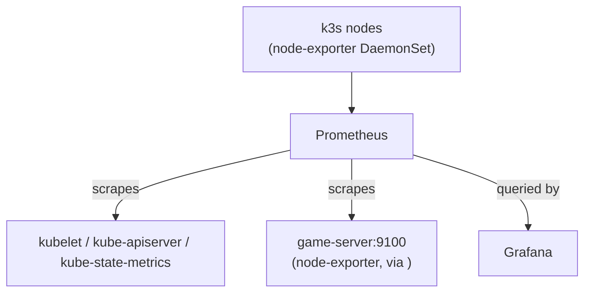

# Monitoring — Prometheus + Grafana

This homelab uses [kube-prometheus-stack](https://github.com/prometheus-community/helm-charts/tree/main/charts/kube-prometheus-stack) to provide cluster-wide metrics collection and dashboards. The stack is deployed via Flux CD as a Helm chart (HelmRelease) and runs entirely inside the k3s cluster.

---

## Overview

| Component              | Purpose                                                                                 |
| ---------------------- | --------------------------------------------------------------------------------------- |
| **Prometheus**         | Scrapes metrics from k3s nodes, pods, kubelet, kube-state-metrics, and external targets |
| **Grafana**            | Dashboard UI — visualise Prometheus data                                                |
| **node-exporter**      | DaemonSet on every k3s node — exposes OS-level metrics (CPU, memory, disk, network)     |
| **kube-state-metrics** | Exposes Kubernetes object state metrics (pod counts, deployment status, etc.)           |

### Access URLs

| Service    | URL                                 |
| ---------- | ----------------------------------- |
| Grafana    | <https://grafana.tailnet.ts.net>    |
| Prometheus | <https://prometheus.tailnet.ts.net> |

Both are exposed via Tailscale Ingress — accessible only to tailnet members (no public internet exposure).

### Architecture



---

## Manifests

| File                                        | Purpose                                           |
| ------------------------------------------- | ------------------------------------------------- |
| `k3s/manifests/monitoring/helmrelease.yaml` | Flux HelmRelease — Helm chart source + all values |

All configuration lives in the HelmRelease's inline Helm values. To change any setting, edit that file and push to `main`. Flux reconciles within ~10 minutes.

---

## Initial Setup (post-deploy)

### 1. Patch the Grafana admin password

The Flux HelmRelease ships with `adminPassword: REPLACE_ME`. After Flux creates the `monitoring-grafana` Secret, patch it with a real password:

```bash
kubectl patch secret monitoring-grafana -n monitoring --type=merge \
  -p '{"stringData":{"admin-password":"your-secure-password"}}'
```

!!! warning "Do not use `kubectl apply`"
Flux uses Server-Side Apply. Always use `kubectl patch --type=merge` to avoid field ownership conflicts.

The secret carries the annotation `kustomize.toolkit.fluxcd.io/reconcile: disabled` to prevent Flux from overwriting the patched value on the next reconcile.

---

## Authentik SSO Setup

Grafana is configured to use Authentik as an OAuth2/OIDC provider. After deploying, two steps are required: configure Authentik, then patch the client credentials into the cluster.

### Step 1: Create the provider and application in Authentik

1. **Create an OAuth2/OpenID Connect Provider** — Applications → Providers → Create
   - Name: `Grafana`
   - Client type: `Confidential`
   - Redirect URIs: `https://grafana.tailnet.ts.net/login/generic_oauth`
   - Signing key: select your existing key
   - Copy the **Client ID** and **Client Secret** — you'll need them below

2. **Create an Application** — Applications → Applications → Create
   - Name: `Grafana`
   - Slug: `grafana`
   - Provider: select the provider from step 1
   - Launch URL: `https://grafana.tailnet.ts.net`

3. **Optionally create a Grafana Admins group** in Authentik — users in this group receive the `Admin` role in Grafana. Users not in any mapped group default to `Viewer`.

### Step 2: Patch the credentials secret

```bash
kubectl patch secret grafana-oauth-secret -n monitoring --type=merge \
  -p '{"stringData":{
    "GF_AUTH_GENERIC_OAUTH_CLIENT_ID":"<client-id-from-authentik>",
    "GF_AUTH_GENERIC_OAUTH_CLIENT_SECRET":"<client-secret-from-authentik>"
  }}'
```

Then restart Grafana to pick up the new env vars:

```bash
kubectl rollout restart deployment/monitoring-grafana -n monitoring
```

### Role mapping

The `role_attribute_path` in `monitoring-app.yaml` maps Authentik groups to Grafana roles:

| Authentik group    | Grafana role |
| ------------------ | ------------ |
| `Grafana Admins`   | Admin        |
| `Grafana Editors`  | Editor       |
| _(any other user)_ | Viewer       |

!!! note "Local admin fallback"
The Grafana `admin` local account remains active as a fallback. The login form is not disabled so you can always reach it at `https://grafana.tailnet.ts.net/login` even if OIDC is misconfigured.

---

## Adding the Game Server to Prometheus

The scrape config in `monitoring-app.yaml` includes a placeholder job for a game-server VM running node-exporter. Follow these steps to activate it.

### Step 1 — Install node-exporter on the game server

SSH into the game-server VM and run:

```bash
# Install node_exporter
sudo apt-get update && sudo apt-get install -y prometheus-node-exporter

# Enable and start the service
sudo systemctl enable prometheus-node-exporter
sudo systemctl start prometheus-node-exporter

# Verify metrics are being exposed
curl http://localhost:9100/metrics | head -20
```

node-exporter listens on port `9100` by default.

### Step 2 — Find the game server's Tailscale IP

On the game-server VM:

```bash
tailscale ip -4
```

Note the IPv4 address (e.g. `<game-server-ts-ip>`). The game server must be joined to the same tailnet (`your-tailnet`) for Prometheus to reach it.

### Step 3 — Update the scrape config

Open `k3s/manifests/monitoring/helmrelease.yaml` and find the `additionalScrapeConfigs` block:

```yaml
additionalScrapeConfigs:
  - job_name: "game-server-node"
    scrape_interval: 30s
    static_configs:
      - targets: ["GAME_SERVER_TAILSCALE_IP:9100"]
        labels:
          instance: "game-server"
          job: "node"
```

Replace `GAME_SERVER_TAILSCALE_IP` with the actual IP from step 2:

```yaml
      - targets: ['<game-server-ts-ip>:9100']
```

Commit and push to `main`. Flux will reconcile and Prometheus will reload its config within ~10 minutes.

### Step 4 — Verify in Prometheus

Open <https://prometheus.tailnet.ts.net/targets> and confirm the `game-server-node` job shows **UP**.

!!! note "Firewall"
    If the game server has `ufw` or `iptables` rules, ensure port `9100` is accessible from the k3s-server Tailscale IP:
    ```bash
    sudo ufw allow from <k3s-server-ts-ip> to any port 9100
    ```

---

## Recommended Grafana Dashboards

Import these community dashboards via **Grafana → Dashboards → Import → enter ID**.

| Dashboard                      | ID       | Purpose                                                                                     |
| ------------------------------ | -------- | ------------------------------------------------------------------------------------------- |
| Node Exporter Full             | `1860`   | Per-node CPU, memory, disk, network — works for both k3s nodes and the game server          |
| Kubernetes Cluster             | `7249`   | Cluster-level overview: pod counts, resource usage, namespace breakdown                     |
| kube-prometheus-stack defaults | built-in | Several dashboards are pre-installed by the Helm chart (look under the `Kubernetes` folder) |

---

## k3s-Specific Configuration

k3s differs from a standard Kubernetes cluster in ways that affect kube-prometheus-stack:

| Setting | Value | Reason |
|---|---|---|
| `kubeProxy.enabled` | `false` | k3s does not run kube-proxy |
| `kubeEtcd.enabled` | `false` | k3s uses SQLite, not etcd |
| `kubeControllerManager.endpoints` | `[<k3s-server-ts-ip>]` | Controller manager runs on the k3s-server node |
| `kubeScheduler.endpoints` | `[<k3s-server-ts-ip>]` | Scheduler also runs on k3s-server |

These are already set in `monitoring-app.yaml`. If the cluster topology changes, update the endpoint IPs there.

---

## Storage

| Component  | PVC size | StorageClass |
| ---------- | -------- | ------------ |
| Grafana    | 1 Gi     | `longhorn`   |
| Prometheus | 20 Gi    | `longhorn`   |

Data retention is set to **15 days** in Prometheus. Adjust `prometheusSpec.retention` in `monitoring-app.yaml` if needed.

---

## Alerting (Future)

Alertmanager is currently **disabled** to keep the homelab setup simple. It can be re-enabled by setting:

```yaml
alertmanager:
  enabled: true
```

in the Helm values inside `monitoring-app.yaml`, then configuring receivers (email, PagerDuty, Slack, etc.) via `alertmanager.config`.

See the [kube-prometheus-stack docs](https://github.com/prometheus-community/helm-charts/tree/main/charts/kube-prometheus-stack#alertmanager) for a full configuration reference.

---

## See Also

- [gitops-flux.md](gitops-flux.md) — How Flux sync and reconciliation work
- [tailscale-operator.md](tailscale-operator.md) — Tailscale Ingress details
- [new-service.md](new-service.md) — Guide for adding new services to the cluster
