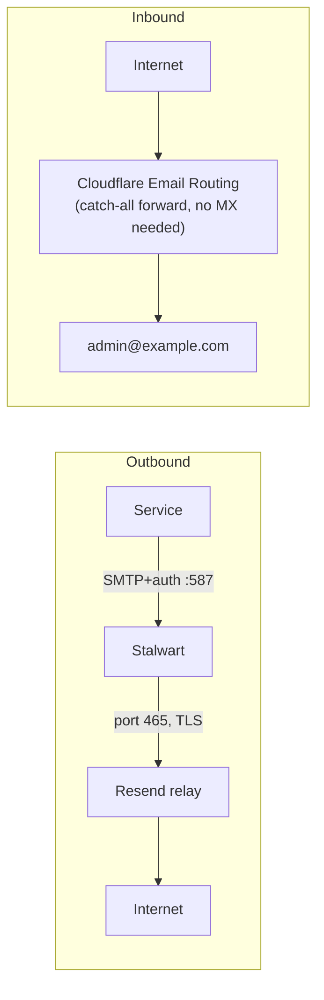

# Stalwart Mail Server

Stalwart is the self-hosted mail server for this homelab. It handles transactional email for internal services (Authentik, alerts, etc.) and provides a webmail interface.

## How It Works



**Why Resend?** Kubernetes nodes block outbound port 25 (standard SMTP). Rather than fight ISP/cloud port restrictions and manage IP reputation, all outbound mail is relayed through Resend's SMTP gateway on port 465. Resend handles SPF/DKIM signing and deliverability. Free tier: 3,000 emails/month.

**Why not direct MX?** Port 25 is blocked at the network level. Any message Stalwart tries to deliver directly will time out.

**Why Cloudflare Email Routing for inbound?** No open ports or MX server required. Cloudflare receives mail for `@example.com` and forwards it to a Gmail address.

## Access

| Interface | URL | Notes |
|---|---|---|
| Webmail + Admin (private) | `https://mail.tailnet.ts.net` | Tailscale only |
| Webmail (public) | `https://mail.example.com` | Cloudflare Tunnel + Authentik SSO |
| Admin credentials | `admin` / see `stalwart-secrets` | SHA-512-crypt hashed in DB |

## Architecture Details

### Kubernetes resources

| Resource | Details |
|---|---|
| Namespace | `stalwart` |
| Image | `stalwartlabs/stalwart:v0.15` |
| Storage | 10Gi Longhorn PVC at `/opt/stalwart/data` |
| Config | ConfigMap rendered by init container into `/opt/stalwart/etc/config.toml` |
| Secrets | `stalwart-secrets` — `admin-password` and `resend-api-key` (REPLACE_ME in git) |

### Init container

An `alpine:3.19` init container runs before Stalwart starts. It:

1. Installs `openssl` (`apk add --no-cache openssl`)
2. Generates a SHA-512-crypt hash of the admin password (`openssl passwd -6`)
3. Uses `sed` to substitute `__STALWART_ADMIN_SECRET_HASH__` and `__RESEND_API_KEY__` tokens in the ConfigMap template
4. Writes the rendered config to an emptyDir volume mounted at `/opt/stalwart/etc/`

### Config vs database

Stalwart stores all configuration in RocksDB. On startup it reads the config file and writes values to the DB. **DB values take precedence over the config file for keys that already exist in the DB.** This means:

- First boot: config file values are written to DB ✓
- Subsequent boots: DB values are used (config file changes are ignored for existing keys)
- To update a setting: change it via the Admin UI, the API, or delete the DB key so the config file value is re-read

The routing strategy (`queue.strategy.route`) and relay definition (`queue.route.resend`) are the critical outbound routing keys.

### Routing strategy

```toml
# Routes local domains to internal store; everything else goes via Resend
[[queue.strategy.route]]
if = "is_local_domain('', rcpt_domain)"
then = "'local'"

[[queue.strategy.route]]
else = "'resend'"

[queue.route.resend]
type = "relay"
address = "smtp.resend.com"
port = 465
protocol = "smtp"

[queue.route.resend.tls]
implicit = true       # port 465 = implicit TLS (not STARTTLS)

[queue.route.resend.auth]
username = "resend"
secret = "<resend-api-key>"
```

This TOML is rendered into `/opt/stalwart/etc/config.toml` by the init container on first boot and written into the database. On subsequent boots Stalwart reads relay settings from the database, not the config file — so changes must be made via the Admin UI or the API (not by editing the ConfigMap).

**Changing relay settings via Admin UI:**

If you need to update the Resend API key or change relay parameters after deploy, log into `https://mail.tailnet.ts.net` and navigate to:

**Settings → Queues & Delivery → Remote Hosts → `resend`**

| Field | Value |
|---|---|
| Address | `smtp.resend.com` |
| Port | `465` |
| TLS | Implicit (SSL/TLS — not STARTTLS) |
| Auth username | `resend` |
| Auth secret | Resend API key (`re_...`) |

To force Stalwart to re-read the relay config from the TOML file instead (e.g. after a fresh PVC), delete the `queue.route.resend.*` and `queue.strategy.route` keys via the API and restart the pod:

```bash
kubectl port-forward -n stalwart svc/stalwart 18080:8080 &
# Delete DB keys so the config file values are re-read on next startup
curl -s -u admin:<password> -X DELETE http://localhost:18080/api/settings/queue.route.resend
curl -s -u admin:<password> -X DELETE http://localhost:18080/api/settings/queue.strategy.route
kubectl rollout restart deployment/stalwart -n stalwart
```

## Connecting a Service to Stalwart

Any pod in the cluster can send email via Stalwart. You need a Stalwart account for authentication.

### Step 1: Create a Stalwart account

Log into `https://mail.tailnet.ts.net` with admin credentials:

1. **Directory → Accounts → New Account**
2. Set the email to `<name>@example.com` (e.g. `noreply`, `alerts`, `myapp`)
3. Set a password — save it, you'll need it for the service config

### Step 2: Configure the service

Use these SMTP settings in any application:

| Setting | Value |
|---|---|
| **SMTP Host** | `stalwart.stalwart.svc.cluster.local` |
| **SMTP Port** | `587` |
| **Encryption** | None / STARTTLS (not implicit TLS — port 587 is plaintext inside the cluster) |
| **Auth** | `PLAIN` or `LOGIN` |
| **Username** | account name only — e.g. `noreply` (NOT `noreply@example.com`) |
| **Password** | the account password set in Stalwart |
| **From address** | `noreply@example.com` (or whichever account you created) |

!!! warning "Username format"
    Stalwart's SMTP auth resolves by **account name**, not email address. Always use the short username (e.g. `noreply`), not the full email address (`noreply@example.com`). Using the full email will return `535 Authentication credentials invalid`.

### Step 3: Store credentials as a secret

Never put SMTP passwords in plaintext in Helm values or manifests. Use a Kubernetes Secret:

```bash
kubectl patch secret <app>-credentials -n <namespace> --type=merge \
  -p '{"stringData":{"smtp-password":"<password>"}}'
```

Reference it in your Helm values or Deployment as an env var:

```yaml
env:
  - name: APP_SMTP_PASSWORD
    valueFrom:
      secretKeyRef:
        name: <app>-credentials
        key: smtp-password
```

### Example: Authentik

Authentik SMTP is configured via Helm values in `k3s/manifests/authentik/helmrelease.yaml` (not the UI — the UI settings are read-only when env vars are set):

```yaml
authentik:
  email:
    host: "stalwart.stalwart.svc.cluster.local"
    port: 587
    username: "noreply"       # account name only, not full email
    use_tls: false
    use_ssl: false
    timeout: 30
    from: "authentik <noreply@example.com>"

extraEnv:
  - name: AUTHENTIK_EMAIL__PASSWORD
    valueFrom:
      secretKeyRef:
        name: authentik-credentials
        key: smtp-password
```

After patching the secret, the Authentik pods will pick up the new credentials on next restart. Test with:

```bash
kubectl exec -n authentik deployment/authentik-worker -- ak test_email <your@email.com>
```

### Example: Generic application (env vars)

```yaml
env:
  - name: SMTP_HOST
    value: "stalwart.stalwart.svc.cluster.local"
  - name: SMTP_PORT
    value: "587"
  - name: SMTP_USERNAME
    value: "noreply"
  - name: SMTP_FROM
    value: "noreply@example.com"
  - name: SMTP_PASSWORD
    valueFrom:
      secretKeyRef:
        name: myapp-credentials
        key: smtp-password
```

## Setup from Scratch

This section covers deploying Stalwart for the first time. All files already exist in the repo — this is a reference for rebuilds or understanding what was created.

### Prerequisites

- [ ] A [Resend](https://resend.com) account with `example.com` verified as a sending domain
- [ ] Resend API key (`re_...`)
- [ ] Cloudflare account ID and zone ID (already in `variables.tf`)
- [ ] `admin_email` variable set in `variables.tf` / `*.tfvars`

### 1. Kubernetes manifests

All files live in `k3s/manifests/stalwart/`. The key files:

**`namespace.yaml`** — creates the `stalwart` namespace.

**`secret.yaml`** — placeholder secrets (REPLACE_ME in git; patched live after deploy):

```yaml
apiVersion: v1
kind: Secret
metadata:
  name: stalwart-secrets
  namespace: stalwart
type: Opaque
stringData:
  admin-password: "REPLACE_ME_strong_password_here"
  resend-api-key:  "REPLACE_ME_resend_api_key_re_xxxx"
```

**`pvc.yaml`** — 10Gi Longhorn PVC mounted at `/opt/stalwart` (RocksDB data lives here).

**`configmap.yaml`** — Stalwart configuration template. Contains `__PLACEHOLDER__` tokens that the init container substitutes at runtime. Key sections:

```toml
# Listeners
[server.listener.http]
bind = "[::]:8080"
protocol = "http"

[server.listener.submission]
bind = "[::]:587"
protocol = "smtp"
auth.require-tls = false   # internal cluster traffic; no TLS needed

[server.listener.imap]
bind = "[::]:993"
protocol = "imap"
tls.implicit = true

# Allow PLAIN/LOGIN on port 587
[[session.auth.mechanisms]]
if = "local_port != 25"
then = "[plain, login, oauthbearer, xoauth2]"

[[session.auth.mechanisms]]
else = "false"

# RocksDB
[store.rocksdb]
type = "rocksdb"
path = "/opt/stalwart/data"    # must be under /opt/stalwart (PVC mount point)

# Admin fallback account (password hashed by init container)
[authentication.fallback-admin]
user = "admin"
secret = "__STALWART_ADMIN_SECRET_HASH__"

# Routing: local → mailbox, everything else → Resend relay
[[queue.strategy.route]]
if = "is_local_domain('', rcpt_domain)"
then = "'local'"

[[queue.strategy.route]]
else = "'resend'"

[queue.route.resend]
type = "relay"
address = "smtp.resend.com"
port = 465
protocol = "smtp"

[queue.route.resend.tls]
implicit = true

[queue.route.resend.auth]
username = "resend"
secret = "__RESEND_API_KEY__"
```

**`deployment.yaml`** — critical details:

- `strategy: type: Recreate` — **required** to avoid RocksDB LOCK conflicts during pod replacement
- Init container (`alpine:3.19`) installs `openssl`, hashes the admin password with `openssl passwd -6`, substitutes tokens in the ConfigMap template, and writes the result to an `emptyDir` volume
- Main container mounts: PVC at `/opt/stalwart` (data), emptyDir at `/opt/stalwart/etc` (config)
- Probes use `tcpSocket` on port 8080 (not HTTP — Stalwart's `/healthz` only exists in newer versions)

**`service.yaml`** — ClusterIP exposing ports 8080 (HTTP/admin), 587 (SMTP), 993 (IMAP).

**`ingress-tailscale.yaml`** — Tailscale ingress at `mail.tailnet.ts.net` (private access):

```yaml
spec:
  ingressClassName: tailscale
  rules:
    - http:
        paths:
          - path: /
            pathType: Prefix
            backend:
              service:
                name: stalwart
                port:
                  number: 8080
  tls:
    - hosts:
        - mail
```

**`ingress-cloudflare.yaml`** — Traefik ingress at `mail.example.com` with Authentik ForwardAuth:

```yaml
metadata:
  annotations:
    cert-manager.io/cluster-issuer: letsencrypt-production
    traefik.ingress.kubernetes.io/router.middlewares: >-
      kube-system-cloudflare-https-scheme@kubernetescrd,authentik-authentik-forward-auth@kubernetescrd
spec:
  ingressClassName: traefik
  rules:
    - host: mail.example.com
      ...
  tls:
    - hosts:
        - mail.example.com
      secretName: stalwart-tls
```

### 2. Flux Kustomization

The `stalwart-secrets` Secret carries the annotation `kustomize.toolkit.fluxcd.io/reconcile: disabled`, which prevents Flux from overwriting patched values during reconciliation.

### 3. OpenTofu — Cloudflare tunnel route

In `opentofu/cloudflare-tunnel.tf`, add the hostname route before the catch-all 404 entry:

```hcl
{
  hostname = "mail.${var.cloudflare_zone_name}"
  service  = "http://traefik.kube-system.svc.cluster.local:80"
},
```

And a DNS CNAME record:

```hcl
resource "cloudflare_dns_record" "mail" {
  zone_id = var.cloudflare_zone_id
  name    = "mail"
  content = "${cloudflare_zero_trust_tunnel_cloudflared.homelab.id}.cfargotunnel.com"
  type    = "CNAME"
  ttl     = 1
  proxied = true
}
```

### 4. OpenTofu — Cloudflare Email Routing

`opentofu/cloudflare-email.tf` enables inbound email forwarding:

```hcl
resource "cloudflare_email_routing_settings" "chronobyte" {
  zone_id = var.cloudflare_zone_id
}

resource "cloudflare_email_routing_address" "admin" {
  account_id = var.cloudflare_account_id
  email      = var.admin_email   # destination Gmail address
}

resource "cloudflare_email_routing_catch_all" "forward_to_admin" {
  zone_id = var.cloudflare_zone_id
  name    = "Forward all to admin"
  enabled = true
  matchers = [{ type = "all" }]
  actions  = [{ type = "forward", value = [cloudflare_email_routing_address.admin.email] }]
  depends_on = [cloudflare_email_routing_settings.chronobyte]
}
```

!!! note "Cloudflare v5 provider"
    `enabled` on `cloudflare_email_routing_settings` is read-only in provider v5 — do not set it.

### 5. OpenTofu — Resend DNS records

In `opentofu/cloudflare.tf`, add the DNS records Resend requires for DKIM/SPF/DMARC:

```hcl
# DKIM
resource "cloudflare_dns_record" "resend_dkim" {
  zone_id = var.cloudflare_zone_id
  name    = "resend._domainkey"
  content = "p=MIGfMA0GCSqGSIb3DQEBAQUAA4GNA..."  # from Resend dashboard
  type    = "TXT"
  ttl     = 1
}

# SPF MX (bounce handling)
resource "cloudflare_dns_record" "resend_spf_mx" {
  zone_id  = var.cloudflare_zone_id
  name     = "send"
  content  = "feedback-smtp.us-east-1.amazonses.com"
  type     = "MX"
  ttl      = 1
  priority = 10
}

# SPF TXT
resource "cloudflare_dns_record" "resend_spf_txt" {
  zone_id = var.cloudflare_zone_id
  name    = "send"
  content = "v=spf1 include:amazonses.com ~all"
  type    = "TXT"
  ttl     = 1
}

# DMARC
resource "cloudflare_dns_record" "resend_dmarc" {
  zone_id = var.cloudflare_zone_id
  name    = "_dmarc"
  content = "v=DMARC1; p=none;"
  type    = "TXT"
  ttl     = 1
}
```

### 6. Deploy

```bash
git add k3s/manifests/stalwart/ \
        k3s/flux/apps/stalwart.yaml \
        opentofu/cloudflare-tunnel.tf \
        opentofu/cloudflare-email.tf \
        opentofu/cloudflare.tf
git commit -m "feat(stalwart): deploy email server"
git push
```

- GitHub Actions runs `tofu apply` automatically on push to `main`
- Flux reconciles within ~10 minutes
- Pod will start but SMTP will not work until secrets are patched (step 7)

### 7. Patch secrets and restart

```bash
kubectl patch secret stalwart-secrets -n stalwart --type=merge \
  -p '{"stringData":{"admin-password":"<your-password>","resend-api-key":"re_..."}}'
kubectl rollout restart deployment/stalwart -n stalwart
kubectl rollout status deployment/stalwart -n stalwart
```

!!! danger "Do not force-reconcile Flux after patching"
    The `stalwart-secrets` Secret has `kustomize.toolkit.fluxcd.io/reconcile: disabled`. Forcing a Flux reconcile or deleting and recreating the secret from git will revert it to `REPLACE_ME`. Let Flux's natural reconcile loop skip the disabled secret.

### 8. Verify Cloudflare Email Routing

Check `var.admin_email` inbox for a Cloudflare verification email. Click the link to activate the catch-all forward. Without this, inbound mail silently drops.

### 9. Create service email accounts

Log into `https://mail.tailnet.ts.net` → **Directory → Accounts → New Account**:

- `noreply@example.com` — default sender for Authentik and other services
- `alerts@example.com` — optional, for monitoring/alerting tools

### 10. Patch Authentik SMTP credentials

```bash
kubectl patch secret authentik-credentials -n authentik --type=merge \
  -p '{"stringData":{"smtp-password":"<noreply-account-password>"}}'
```

Then wait for the Authentik pods to restart and pick up the new SMTP credentials. Verify:

```bash
kubectl exec -n authentik deployment/authentik-worker -- ak test_email <your@email.com>
# Look for: "message": "Email to ... sent"
```

### 11. (Optional) Authentik SSO for public webmail

After the `mail.example.com` Cloudflare ingress is live, protect it with Authentik:

1. **Applications → Providers → Create** → Proxy Provider
   - Mode: Forward auth (single application)
   - External Host: `https://mail.example.com`
2. **Applications → Applications → Create** → link to the provider
3. **Applications → Outposts → Edit `authentik Embedded Outpost`** → move the new app to selected

See `docs/authentik.md` for the full procedure.

---

## Post-Deploy Setup (Required After Fresh Install)

### 1. Patch secrets

Secrets in git contain `REPLACE_ME` placeholders. After Flux creates the Secret:

```bash
kubectl patch secret stalwart-secrets -n stalwart --type=merge \
  -p '{"stringData":{"admin-password":"<password>","resend-api-key":"re_..."}}'
kubectl rollout restart deployment/stalwart -n stalwart
```

!!! danger "Do not force-reconcile Flux after patching"
    The `stalwart-secrets` Secret has `kustomize.toolkit.fluxcd.io/reconcile: disabled`. Forcing a Flux reconcile or recreating the Secret from git will revert it to `REPLACE_ME`. See [gitops-flux.md](gitops-flux.md) for the patched secrets pattern.

### 2. Verify Cloudflare Email Routing

After `tofu apply` runs on push to `main`:

1. Check `admin@example.com` for a Cloudflare verification email
2. Click the link to activate the catch-all forward to Gmail

### 3. Create service accounts

Log into `https://mail.tailnet.ts.net`:

1. **Directory → Accounts → New Account**
2. Create `noreply@example.com` (used by Authentik and as the default sender)
3. Optionally create `alerts@example.com`, `admin@example.com`

### 4. (Optional) Enable Authentik SSO for public webmail

After Flux syncs `mail.example.com`:

1. **Create Provider** → Forward Auth (Single Application), External Host: `https://mail.example.com`
2. **Create Application** → link to the provider
3. **Edit Embedded Outpost** → add the application

See `docs/authentik.md` for details.

## Troubleshooting

### Check Stalwart logs

```bash
kubectl logs -n stalwart deployment/stalwart --since=10m
```

Key events to look for:

| Log event | Meaning |
|---|---|
| `auth.success` | SMTP login succeeded |
| `auth.error` | SMTP login failed |
| `queue.queue-message-authenticated` | Message accepted into queue |
| `delivery.connect` | Connecting to relay/destination |
| `delivery.delivered` | Message accepted by relay (code 250) |
| `delivery.connect-error` | Failed to reach relay — check routing config |
| `delivery.domain-delivery-start` + `domain = "gmail.com"` | **Going direct to MX, not relay** — routing misconfigured |

### Email goes direct to Gmail instead of Resend

**Symptom**: Logs show `Fetching MTA-STS policy for gmail.com` / `Connecting to gmail-smtp-in.l.google.com` instead of `smtp.resend.com`.

**Cause**: The `queue.strategy.route` routing expression is missing or the DB has overriding values.

**Fix**:
```bash
# Port-forward to the Stalwart admin API
kubectl port-forward -n stalwart svc/stalwart 18080:8080 &

# Verify routing strategy is set
curl -s -u 'admin:<password>' \
  'http://localhost:18080/api/settings/list?prefix=queue.strategy'

# If missing, the configmap values weren't loaded. Check they exist in config:
kubectl exec -n stalwart deployment/stalwart -- \
  grep -A5 "queue.strategy" /opt/stalwart/etc/config.toml

# Delete any stale DB keys so the config file values are re-read on restart
curl -s -u 'admin:<password>' -X DELETE \
  'http://localhost:18080/api/settings/queue.strategy.route.0001.else'

kubectl rollout restart deployment/stalwart -n stalwart
```

### SMTP auth fails (535 Authentication credentials invalid)

**Check 1 — Username format**: Use the account short name (`noreply`), NOT the full email (`noreply@example.com`).

**Check 2 — Account exists**: Log into the Admin UI → Directory → Accounts. If the PVC was recreated, accounts must be re-created.

**Check 3 — Password hash**: Stalwart stores passwords as SHA-512-crypt hashes (`$6$...`). If an account was created via API with a plaintext password it will always fail. Re-set via the Admin UI or:

```bash
kubectl port-forward -n stalwart svc/stalwart 18080:8080 &

# Hash the password
HASH=$(openssl passwd -6 'mypassword')

# PATCH the account's secret field
curl -s -u 'admin:<password>' -X PATCH \
  'http://localhost:18080/api/principal/noreply' \
  -H 'Content-Type: application/json' \
  -d "[{\"action\":\"set\",\"field\":\"secrets\",\"value\":[\"$HASH\"]}]"
```

### SMTP auth fails (No suitable authentication method found)

**Cause**: Stalwart is only advertising `XOAUTH2`/`OAUTHBEARER` on port 587 — this happens when the `session.auth.mechanisms` IfBlock is missing or incorrect in the DB.

**Fix**: Verify the ConfigMap has the IfBlock and that it was loaded:

```bash
kubectl exec -n stalwart deployment/stalwart -- \
  grep -A6 "session.auth.mechanisms" /opt/stalwart/etc/config.toml
```

The correct config is:
```toml
[[session.auth.mechanisms]]
if = "local_port != 25"
then = "[plain, login, oauthbearer, xoauth2]"

[[session.auth.mechanisms]]
else = "false"
```

If the DB has stale values, delete them:

```bash
curl -s -u 'admin:<password>' -X DELETE \
  'http://localhost:18080/api/settings/session.auth.mechanisms.0000.if'
# (repeat for all mechanism keys, then restart)
kubectl rollout restart deployment/stalwart -n stalwart
```

### Stalwart won't start (RocksDB LOCK error)

**Cause**: A previous pod is still holding the RocksDB lock. This happens if the deployment strategy is `RollingUpdate` — the new pod starts before the old one stops.

**Fix**: The deployment uses `strategy: type: Recreate`. If this was accidentally changed:

```bash
kubectl patch deployment stalwart -n stalwart \
  --type=json \
  -p='[{"op":"replace","path":"/spec/strategy/type","value":"Recreate"}]'
```

### Admin UI shows "Unsupported server version"

The webadmin UI requires Stalwart v0.13+. If the image is too old:

```bash
# Check running image
kubectl get deployment stalwart -n stalwart \
  -o jsonpath='{.spec.template.spec.containers[0].image}'

# Should be: stalwartlabs/stalwart:v0.15
# Old repo was: stalwartlabs/mail-server (do not use)
```

### Checking the Stalwart admin API

The admin API is available on port 8080 and uses HTTP Basic Auth:

```bash
kubectl port-forward -n stalwart svc/stalwart 18080:8080 &

# List any config prefix
curl -s -u 'admin:<password>' \
  'http://localhost:18080/api/settings/list?prefix=queue'

# Delete a single config key (forces re-read from config file on restart)
curl -s -u 'admin:<password>' -X DELETE \
  'http://localhost:18080/api/settings/<key>'

# List all accounts
curl -s -u 'admin:<password>' \
  'http://localhost:18080/api/principal?limit=50'
```

!!! note "No POST/PUT support found"
    The settings API supports GET (list) and DELETE. To write new values, update the ConfigMap and restart the pod (for keys not yet in DB), or use the Admin UI.

## DNS Records (Managed by OpenTofu)

All DNS is in `opentofu/cloudflare.tf` and `opentofu/cloudflare-tunnel.tf`:

| Record | Type | Purpose |
|---|---|---|
| `resend._domainkey.example.com` | TXT | Resend DKIM signing key |
| `send.example.com` | MX → `feedback-smtp.us-east-1.amazonses.com` | Resend bounce handling |
| `send.example.com` | TXT → `v=spf1 include:amazonses.com ~all` | Resend SPF |
| `_dmarc.example.com` | TXT → `v=DMARC1; p=none;` | DMARC policy |
| `mail.example.com` | CNAME → Cloudflare Tunnel | Public webmail |

Cloudflare Email Routing (catch-all → `admin@example.com`) is managed by `opentofu/cloudflare-email.tf`.

## Key Technical Notes

- **`stalwartlabs/stalwart:v0.15`** — image repository changed from `stalwartlabs/mail-server` in v0.11
- **Data path `/opt/stalwart/`** — changed from `/opt/stalwart-mail/` in v0.11; PVC must mount here
- **`Recreate` strategy** — required because RocksDB holds an exclusive file lock; RollingUpdate deadlocks
- **DB vs config file** — DB takes precedence for existing keys; delete DB keys via API to force config file re-read
- **`queue.strategy.route`** — the IfBlock that controls outbound routing; without it, Stalwart attempts direct MX delivery (which fails because port 25 is blocked)
