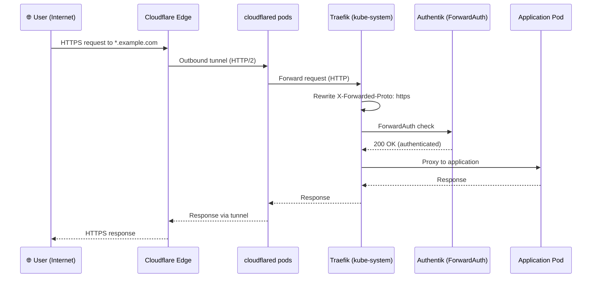
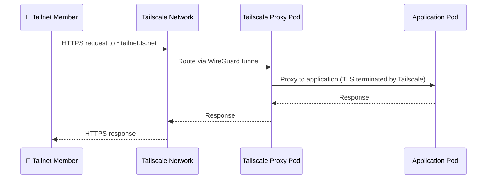
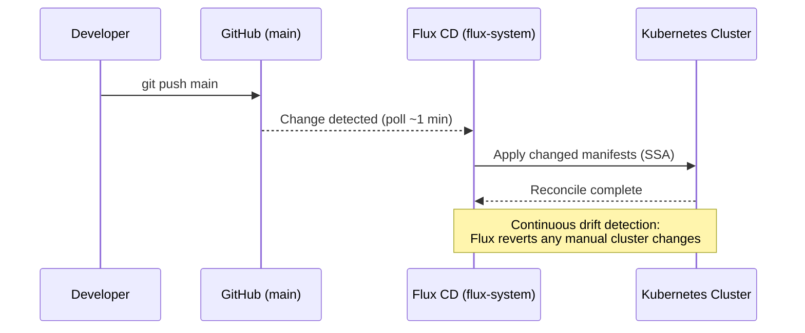
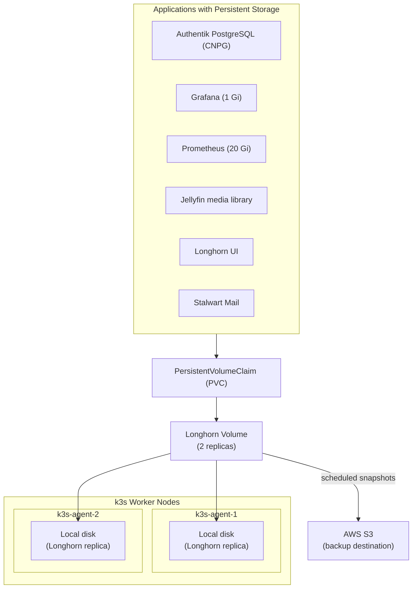
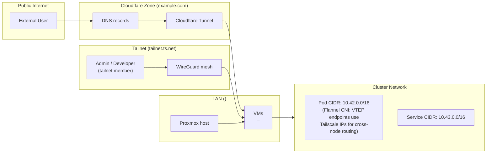

# Homelab Topology

This page provides a complete visual overview of the homelab infrastructure — from physical hardware to running services and how everything connects.

---

## Full Topology Diagram

```mermaid
graph TD
    %% Physical layer
    subgraph physical["Physical Server: chronobyte (<proxmox-lan-ip>)"]
        subgraph proxmox["Proxmox VE — hypervisor"]
            srv["VM: k3s-server (VMID 102)<br/>LAN: <k3s-server-lan-ip><br/>Tailscale: <k3s-server-ts-ip><br/>Role: control plane"]
            ag1["VM: k3s-agent-1 (VMID 101)<br/>LAN: <k3s-agent-1-lan-ip><br/>Tailscale: <k3s-agent-1-ts-ip><br/>Role: worker node"]
            ag2["VM: k3s-agent-2 (VMID 103)<br/>LAN: <k3s-agent-2-lan-ip><br/>Tailscale: <k3s-agent-2-ts-ip><br/>Role: worker node"]
            gamesrv["VM: game-server (VMID 104)<br/>LAN: DHCP<br/>Tailscale: auto-assigned<br/>Role: Minecraft"]
        end
    end

    %% k3s cluster topology
    srv -->|"control plane → worker"| ag1
    srv -->|"control plane → worker"| ag2

    %% Networking layer
    subgraph tailnet["Tailnet: tailnet.ts.net"]
        tsop["Tailscale Operator<br/>(namespace: tailscale)"]
    end

    srv --- tailnet
    ag1 --- tailnet
    ag2 --- tailnet
    gamesrv --- tailnet

    %% Public internet routing
    subgraph cloudflare["Cloudflare (example.com)"]
        cfedge["Cloudflare Edge<br/>(DNS + WAF)"]
        cftunnel["Cloudflare Tunnel<br/>ID: managed in OpenTofu"]
    end

    internet["🌐 Internet"] --> cfedge
    cfedge --> cftunnel

    subgraph cluster["k3s Cluster — In-cluster components"]
        cfd["cloudflared<br/>(namespace: cloudflared, 2 replicas)"]
        traefik["Traefik Ingress<br/>(kube-system)"]
        certmgr["cert-manager<br/>ClusterIssuer: letsencrypt-production"]
        metallb["MetalLB<br/>(metallb-system)"]
        longhorn["Longhorn Storage<br/>(longhorn-system)"]
        cnpg["CNPG PostgreSQL Operator<br/>(cnpg-system)"]
        flux["Flux CD<br/>(flux-system)"]
    end

    cftunnel -->|"outbound tunnel"| cfd
    cfd --> traefik
    certmgr --> traefik

    %% Tailscale-exposed services
    subgraph ts_services["Services via Tailscale Ingress (*.tailnet.ts.net)"]
        authentik_ts["Authentik SSO<br/>authentik.tailnet.ts.net"]
        jellyfin["Jellyfin + FileBrowser + Transmission + Metube<br/>jellyfin / jellyfin-files / jellyfin-transmission / jellyfin-ytdl"]
        calibre["Calibre-Web<br/>calibre-web.tailnet.ts.net"]
        adguard["AdGuard Home<br/>adguard.tailnet.ts.net"]
        stalwart_ts["Stalwart Mail<br/>mail.tailnet.ts.net"]
        uptime_ts["Uptime Kuma<br/>uptime-kuma.tailnet.ts.net"]
        ntfy["Ntfy<br/>ntfy.tailnet.ts.net"]
        dashy["Dashy<br/>dashy.tailnet.ts.net"]
        docs["GitHub Pages<br/>docs.chronobyte.net"]
    end

    tsop -->|"provisions proxy pods"| ts_services

    %% Cloudflare-exposed services
    subgraph cf_services["Services via Cloudflare Tunnel (*.example.com)"]
        uptime["Uptime Kuma<br/>uptime.example.com"]
        jellyfin_pub["Jellyfin<br/>jellyfin.example.com"]
        calibre_pub["Calibre-Web<br/>calibre.example.com"]
        mail_pub["Stalwart Mail<br/>mail.example.com"]
    end

    traefik --> cf_services

    %% GitOps
    subgraph gitops["GitOps — GitHub → Flux CD"]
        github["GitHub<br/>hexabyte8/homelab<br/>(main branch)"]
        fluxsrc["Flux source-controller<br/>polls git every ~1 min"]
        fluxkust["Flux kustomize-controller<br/>reconciles k3s/flux/apps/"]
    end

    github -->|"poll ~1 min"| fluxsrc
    fluxsrc --> fluxkust
    fluxkust -->|"reconciles manifests"| cluster

    %% External services
    subgraph external["External / Cloud Services"]
        gh_actions["GitHub Actions<br/>(CI/CD: OpenTofu apply, Ansible)"]
        opentofu["OpenTofu<br/>(IaC: VMs, DNS, S3, Tailscale ACLs)"]
        aws_s3["AWS S3<br/>chronobyte-homelab-tf-state<br/>TF state + game backups"]
        bitwarden["Bitwarden Secrets Manager<br/>(all credentials)"]
        tailscale_ctrl["Tailscale Control Plane<br/>(tailscale.com)"]
    end

    github --> gh_actions
    gh_actions --> opentofu
    opentofu -->|"state backend"| aws_s3
    gh_actions -->|"injects secrets"| bitwarden
    tailnet <-->|"WireGuard mesh"| tailscale_ctrl

    %% Authentik SSO integration
    authentik_ts -->|"ForwardAuth (via Traefik middleware)"| cf_services
    cnpg -->|"PostgreSQL for"| authentik_ts
```

Parked applications (`linkwarden`, `monitoring`, `monitoring-config`, `pegaprox`) are omitted from `k3s/flux/apps/kustomization.yaml` and are intentionally excluded from the active topology.

---

## Traffic Flow: Public Request (Cloudflare Tunnel)

---

## Traffic Flow: Private Request (Tailscale)

---

## GitOps Sync Flow

---

## Storage Architecture

---

## Network Zones

