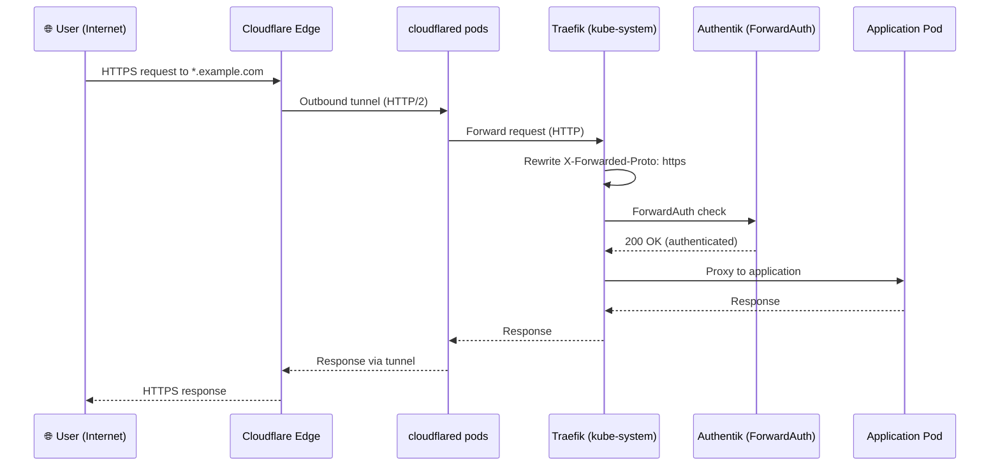
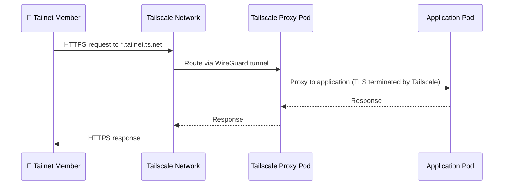
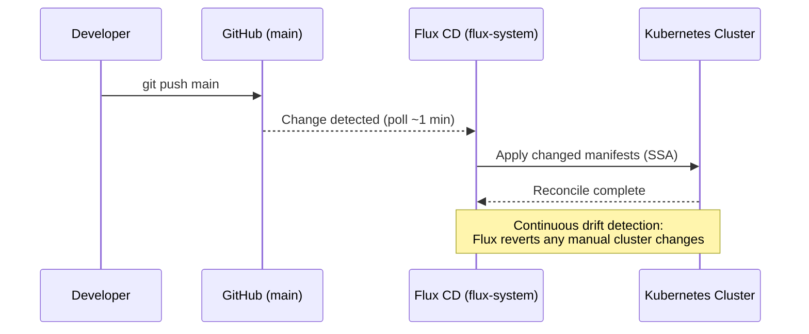
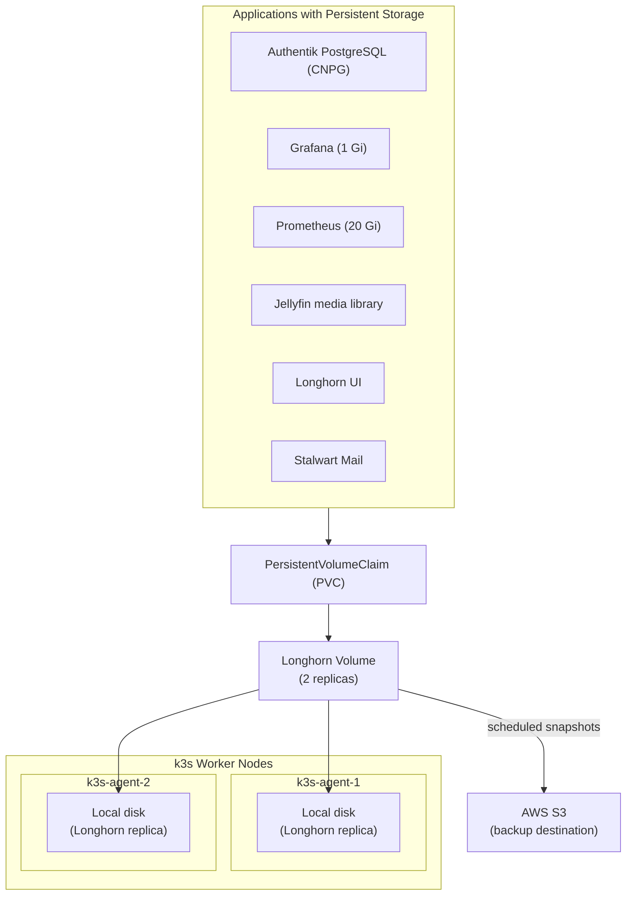
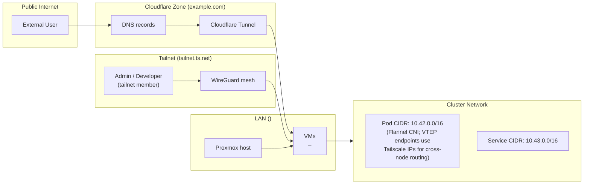

# Homelab Topology

This page provides a complete visual overview of the homelab infrastructure — from physical hardware to running services and how everything connects.

---

## Traffic Flow: Public Request (Cloudflare Tunnel)

---

## Traffic Flow: Private Request (Tailscale)

---

## GitOps Sync Flow

---

## Storage Architecture

---

## Network Zones

